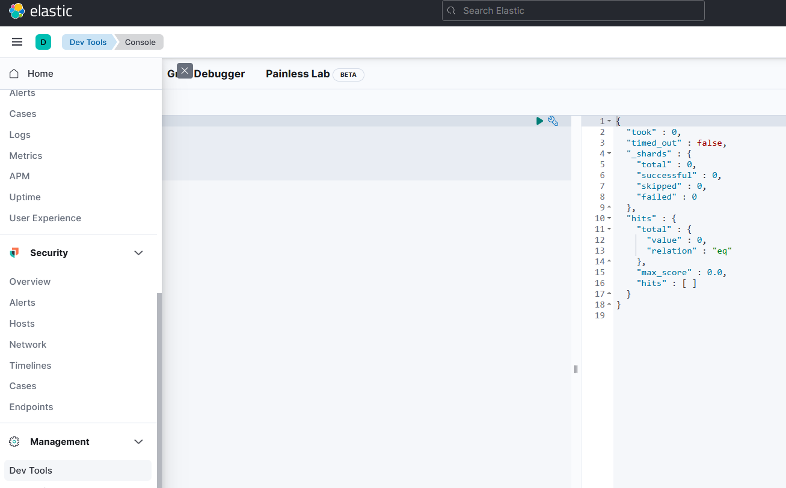

# 환경 설정 (도커)

```bash
## ELK 설치
$ docker pull elasticsearch:8.1.0
# docker pull kibana:8.1.0
$ docker pull logstash:8.1.0

```

```bash
## ELK 실행

# ELK 연동 네트워크 생성 (이름은 아무거나)
$ docker network create somenetwork

# ElasticSearch 실행
$ docker run -d --name elasticsearch --net somenetwork -p 9200:9200 -p 9300:9300 \
-e "discovery.type=single-node" image_id

# Kibana 실행
$ docker run -d --name kibana --net somenetwork -p 5601:5601 kibana_image_id

# logstash
$ docker run -d --name logstash --net somenetwork log_id
```

> 이제 [http://localhost:5601](http://localhost:5601) 으로 접속하여 키바나에 접근할 수 있게 됩니다.
최초 접속시 토큰 등록이 필요하며, 아래와 같이 진행합니다.
> 

```bash
$ docker exec -it {엘라스틱서치container_id} bash
$ bin/elasticsearch-create-enrollment-token --scope kibana
```

키바나 토큰을 최초 생성하고 해당 토큰을 카바나 사이트에 등록합니다.

> 다음으로는 보안 코드가 필요합니다.
> 

```bash
$ docker exec -it {키바나container_id} bash
$ bin/kibana-verification-code
```

