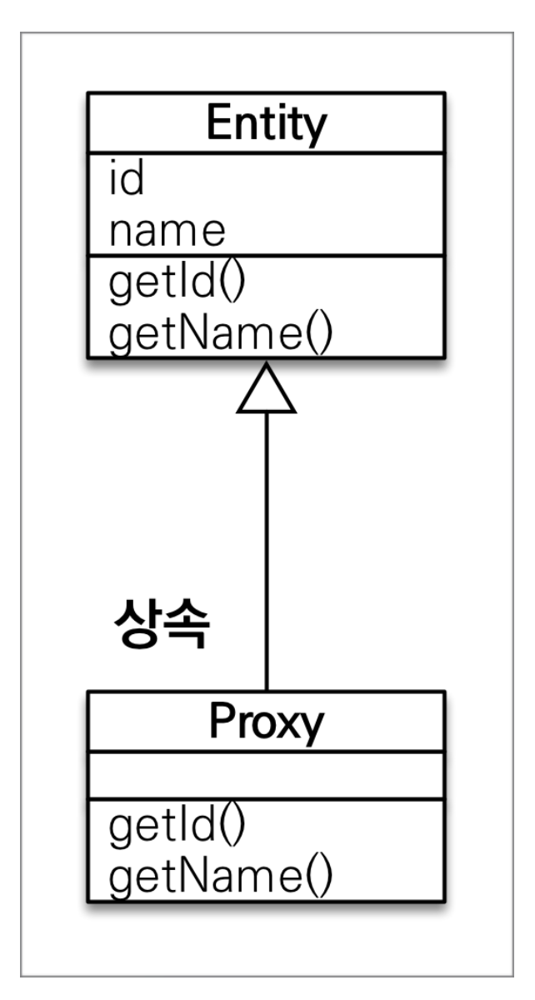

# JPA 프록시와 연관관계 관리

## **👋 목차**

- 프록시
- 즉시 로딩과 지연 로딩
- 지연 로딩 활용
- 영속성 전이: CASCADE
- 고아 객체
- 영속성 전이 + 고아 객체, 생명주기

---

## 프록시

### 프록시 기초

**em.find() vs em.getReference()**

- find(): 데이터베이스를 통해서 실제 **엔티티** 조회
- em.getReference(): 데이터베이스 조회를 미루는 **가짜(프록시) 엔티티** 객체 조회

### 프록시 특징

- 실제 클래스를 상속 받아서 만들어짐
- 실제 클래스와 겉 모양이 같다.
- 사용하는 입장에서는 진짜 객체인지 프록시 객체인지 구분하지 않고 사용하면 됨 (이론상)
- 프롤시 객체는 실제 객체의 참조(target)를 보관
- 프록시 객체를 호출하면 프록시 객체는 실제 객체의 메소드 호출




### **프록시 객체의 초기화**

프록시로 가지고있다가 요청할때 실제 엔티티를 요청 한다.

```java
class {
	
	void main() {
		Member member = em.getReference(Member.class, "id");
		member.getName();
	}

}
```


### 프록시의 특징2 (중요)

- 프록시 객체는 처음 사용할 때 한 번만 초기화
- 프록시 객체를 초기화 할 때, 프록시 객체가 실제 엔티티로 바뀌는 것은 아님, 초기화되면 프록시 객체를 통해서 실제 엔티티에 접근 가능
- 프록시 객체는 원본 엔티티를 상속받음, 따라서 타입 체크시 주의해야함 (== 비교 실패, 대신 instance of 사용)
- 영속성 컨텍스트에 찾는 엔티티가 이미 있으면 em.getReference()를 호출해도 실제 엔티티 반환
    - 반대의 경우 먼저 reference 를 조회한 후 find 를 하면 프록시 객체를 find에 반환한다.
- 영속성 컨텍스트의 도움을 받을 수 없는 준영속 상태일 때, 프록시를 초기화하면 문제 발생 (하이버네이트는 org.hibernate.LazyInitializationException 예외를 터트림)

```java
//영속성 컨텍스트의 도움을 받을 수 없는 준영속 상태일 때, 프록시를 초기화하면 문제 발생 

Member refMember = em.getReference(Member.class , 1L);

em.detach(refMember);

refmember.getUsername();

// error 발생
// 프록시는 영속성 컨텍스트를 통해 실제 엔티티 객체를 요청 하는데
// detch 로 refMember를 더이상 영속성 컨텍스트가 관리하지 않기 때문에 에러가 발생함
// em.close 도 마찬가지다

```

### 프록시 확인

- 프록시 인스턴스의 초기화 여부 확인
    
    PersistenceUnitUtil.isLoaded(Object entity)
    
- 프록시 클래스 확인 방법
    
    entity.getClass().getName() 출력(..javasist.. or
    HibernateProxy...)
    
- 프록시 강제 초기화
    
    org.hibernate.Hibernate.initialize(entity);
    
- 참고: JPA 표준은 강제 초기화 없음
    
    강제 호출: member.getName()
    

---

## 즉시 로딩과 지연 로딩

### 지연 로딩

**문제**

Member를 조회할 때  Team도 함께 조회해야 할까?

단순히 member.getName() 만 사용한다.

**FetchType.LAZY**

**사전 자료**

```java
class Member {
	@Id
	private Long id;
	private String name;
	
	@ManyToOne(fetch = FetchType.LAZY)
	@JoinColumn()
	Team team;
}
```

```java
Member member = em.find(Member.class, 1L);
println(member.getName());
```

```java

Team team = new Team();
team.setName("Team1");
em.persist(team);

Member member1 = new Member();
member1.setUsername("홍길동");
member1.setTeam(team);
em.persist(member1);

member.setTeam(team);

Member member = em.find(Member.class, member1.getId());
member.getTeam().getClass(); // 프록시로 나옴

member.getTeam().getName(); // 사용하는 순간 쿼리를 날림
```


### 즉시 로딩

**문제**

Member를 사용할땐 무조건 Team 같이 사용한다.

대부분의 로직에서 Member 와 Team 은 함께 간다.

**FetchType.EAGER**

**사전 자료**

```java
class Member {
	@Id
	private Long id;
	private String name;
	
	@ManyToOne(fetch = FetchType.EAGER)
	@JoinColumn()
	Team team;
}
```

**실행**

```java
Team team = new Team();
team.setName("Team1");
em.persist(team);

Member member1 = new Member();
member1.setUsername("홍길동");
member1.setTeam(team);
em.persist(member1);

member.setTeam(team);

Member member = em.find(Member.class, member1.getId());
member.getTeam().getClass(); // 엔티티로 나옴
member.getTeam().getName(); // 미리 조인해서 모든 결과를 가져옴
```


### 프록시와 즉시로딩 주의

- 가급적 지연 로딩만 사용(특히 실무에서)
- 즉시 로딩을 적용하면 예상하지 못한 SQL이 발생
- 즉시 로딩은 JPQL에서 N+1 문제를 일으킨다.
- @MonyToOne, @OneToOne은 기본이 즉시 로딩 → LAZY로 설정
- @OneToMany, @ManyToMany는 기본이 지연 로딩

---

## 지연 로딩 활용

- Member와 Team은 자주 함께 사용 → 즉시 로딩
- Member와 Order는 가끔 사용 → 지연 로딩
- Order와 Product는 자주 함께 사용 → 즉시 로딩
- 왠만해서는 지연 로딩을 권장

### 지연 로딩 활용 - 실무

- 모든 연관관계에서 지연 로딩을 사용해라!
- 실무에서 즉시 로딩을 사용하지 마라
- JPQL fetch 조인이나, 엔티티 그래프 기능을 사용해라!
- 즉시 로딩은 상상하지 못한 쿼리가 나간다.

---

## 영속성 전이: CASCADE

- 특정 엔티티를 영속 상태로 만들 때 연관된 엔티티도 함께 영속 상태로 만들고 싶을 때
- 예: 부모 엔티티를 저장할 때 자식 엔티티도 함께 저장

```java

@Entity
class Parent {
	
	@Id
	private Long id;

	private String name;
	
	@OneToMany(mappedBy = "parent", cascade = CascadeType.ALL)
	private List<Child> childList = new ArrayList<>();
	
	public void addChild(Child child) {
		childList.add(child);
		child.setParent(this);
	}

}

@Entity
class Child {
	
	@Id
	private Long id;
	private String name;
	
	@ManyToOne
	@JoinColumn(name = "parent_id")
	private Parent parent;	

}

```


### 영속성 전이: CASCADE - 주의

- 영속성 전이는 연관관계를 매핑하는 것과 아무 관련이 없음
- 엔티티를 영속화할 때 연관된 엔티티도 함께 영속화하는 편리함을 제공할 뿐

### CASCADE의 종류

- **ALL: 모두 적용**
- **PERSIST: 영속**
- **REMOVE: 삭제**
- MERGE: 병합
- REFRESH: REFRESH
- DETACH: DETACH

---

## 고아 객체

- 고아 객체 제거: 부모 엔티티와 연관관계가 끊어진 자식 엔티티를 자동으로 삭제
- orphanRemoval = true, @OneToMany 에 옵션으로 줄수 있다.

```java
//Code
Parent parent = em.find(Parent.class, id);
parent.getChildren().remove(0);

//쿼리
delete from child where id = ?
```

### 고아 객체 - 주의

- 참조가 제거된 엔티티는 다른 곳에서 참조하지 않는 고아 객체로 보고 삭제하는 기능
- **참조하는 곳이 하나일 때 사용해야함!**
- **특정 엔티티가 개인 소유할 때 사용**
- @OneToOne, @OneToMany 만 가능
- 참고: 개념적으로 부모를 제거하면 자식은 고아가 된다 따라서 고아 객체 제거 기능을 활성화 하면, 부모를 제거할 때 자식도 함께 제거된다. 이것은 CascadeType.REMOVE처럼 동작한다.

---

## 영속성 전이 + 고아 객체, 생명주기

- **CascadeType.ALL + orphanRemovel = true**
- 스스로 생명주기를 관리하는 엔티티는 em.persist()로 영속화, em.remove()로 제거
- 두 옵션을 모두 활성화 하면 부모 엔티티를 통해서 자식의 생명 주기를 관리할 수 있음
- 도메인 주도 설계(DDD)의 Aggregate 개념을 구현할 때 유용