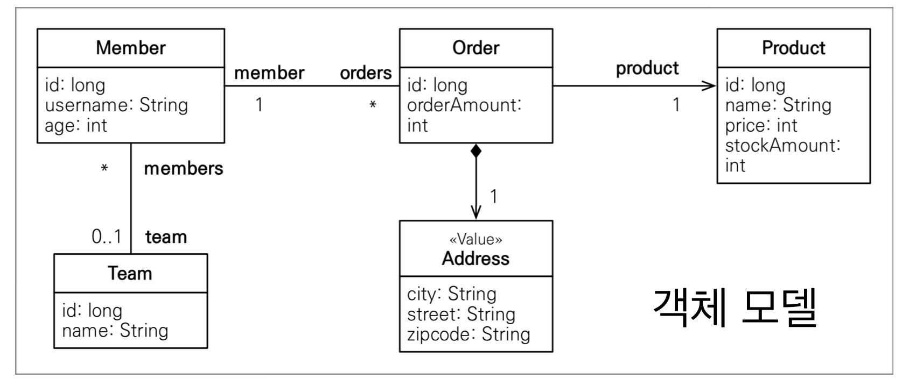

# JPA 객체지향 쿼리 언어

## **👋 목차**

- 객체지향 쿼리 언어 소개
- JPQL
- 기본 문법과 기능
- 페치 조인
- 경로 표현식
- 다형성 쿼리
- 엔티티 직접 사용
- Named 쿼리
- 벌크 연산

---

## 객체 지향 쿼리 언어 소개

### JPA는 다양한 쿼리 방법을 지원

- JPQL
- JPA Criteria
- QueryDSL
- 네이티브 SQL
- JDBC API 직접 사용, Mybatis...

### JPQL 소개

- 가장 단순한 조회 방법
    - Entitymanager.find()
    - 객체 그래프 탐색(a.getB().getC())
    
- JPA를 사용하면 엔티티 객체를 중심으로 개발
- 문제는 검색 쿼리
- 검색을 할 때도 테이블이 아닌 엔티티 객체를 대상으로 검색
- 모든 DB데이터를 객체로 변환해서 검색하는 것은 불가능
- 애플리케이션 필요한 데이터만 DB에서 불러오려면 결국 검색 조건이 포함된 SQL이 필요
- JPA는 SQL을 추상화한 JPQL 이라는 객체 지향 쿼리 언어 제공
- SQL과 문법 유사, SELECT, FROM, WHERE , GROUP BY, HAVING, JOIN 지원
- JPQL은 엔티티 객체를 대상으로 쿼리
- SQL은 데이터베이스 테이블을 대상으로 쿼리

```java
// 간단한 검색
String jpql = "select m From Member m where m.name like '%hello%'";

List<Member> result = em.createQuery(jpql, Member.class).getResultList();

		select
          m.id as id,
          m.age as age,
          m.USERNAME as USERNAME,
          m.TEAM_ID as TEAM_ID
		from
		Member m
		      where
		          m.age>18
```

**정리**

- 테이블이 아닌 객체를 대상으로 검색하는 객체 지향 쿼리
- SQL을 추상화해서 특정 데이터베이스 SQL에 의존X
- JPQL을 한마디로 정의하면 객체 지향 SQL

### Criteria 소개

- 문자가 아닌 자바코드로 JPQL을 작성할 수 ㅇ닜음
- JPQL 빌더 역할
- JPA 공식 기능
- 단점: 너무 복잡하고 실용성이 없다.
- Criteria 대신에 QueryDSL 사용 권장.

```java
//Criteria 사용 준비
CriteriaBuilder cb = em.getCriteriaBuilder(); 
CriteriaQuery<Member> query = cb.createQuery(Member.class);

//루트 클래스 (조회를 시작할 클래스)
Root<Member> m = query.from(Member.class);

//쿼리 생성 
CriteriaQuery<Member> cq =  query.select(m).where(cb.equal(m.get("username"), “kim”)); 
List<Member> resultList = em.createQuery(cq).getResultList();
```

### QueryDSL 소개

- 문자가 아닌 자바코드로 JPQL을 작성할 수 있음
- JPQL 빌더 역할
- 컴파일 시점에 문법 오류를 찾을 수 있음
- 동적쿼리 작성 편리함
- **단순 하고 쉬움**
- **실무 사용 권장**

```java
//JPQL
 //select m from Member m where m.age > 18
JPAFactoryQuery query = new JPAQueryFactory(em); 
QMember m = QMember.member;

List<Member> list = 
			query.selectFrom(m)
					.where(m.age.gt(18))
					.orderBy(m.name.desc())
					.fetch();
```

### 네이티브 SQL 소개

- JPA가 제공하는 SQL을 직접 사용하는 기능
- JPQL로 해결할 수 없는 특정 데이터베이스에 의존적인 기능
- 예) 오라클 CONNECT BY, 특정 DB 만 사용하는 SQL 힌트

### JDBC 직접 사용, SpringJdbcTemplate 등

- JPA를 사용하면서 JDBC 커넥션을 직접 사용하건, 스프링 JdbcTemplate, Mybatis 등을 함께 사용 가능
- 단 영속성 컨텍스트를 적절한 시점에 강제로 플러시 필요
- 예) JPA를 우회해서 SQL을 실행하기 직전에 영속성 컨텍스트 수동 플러시

---

## JPQL(Java Persistence Query Language)

### JPQL 소개

- JPQL은 객체지향 쿼리 언어다. 따라서 테이블을 대상으로 쿼리 하는 것이 아니라 엔티티 객체를 대상으로 쿼리한다.
- JPQL은 SQL을 추상화해서 특정데이터베이스 SQL에 의존하지 않는다.
- JPQL은 결국 SQL로 변환된다.

### JPQL 설명용 모델




### JPQL 문법

- select m from Member as m where m.age > 18
- 엔티티와 속성은 대소문자 구분O ( Member, age )
- JPQL 키워드는 대소문자 구분X ( SELECT, from, where)
- 엔티티 이름 사용, 테이블 이름이 아님(Member)
- **별칭은 필수 (m) (as는 생략 가능)**


### TypeQuery, Query

- TypeQuery: 반환 타입이 명확할 때 사용
- Query: 반환 타입이 명확하지 않을 때 사용

```java
TypedQuery<Member> query = em.createQuery("SELECT m FROM Member m ", member.class);
Query query = em.createQuery("SELECT m.username, m.age from Memberm");
```

### 결과 조회 API

- query.getResultList(): 결과가 하나 이상일 때, 리스트 반환
    - 결과가 없으면 빈 리스트 반환
- query.getSingleResult(): 결과가 정확히 하나, 단일 객체 반환
    - 결과가 없으면: javax.persistence.NoResultException
    - 둘 이상이면: javax.persistence.NonUniqueResultException

### 파라미터 바인딩 - 이름 기준, 위치 기준

- 이름 기준

```java
Query query =em.createQuery("SELECT m from Member m where m.username=:username", Member.class)
query.setparameter("username", usernameParam);
```

- 위치 기준

```java
Query query = em.createQuery("SELECT m FROM Member m where m.username=?1", Member.class);
query.setParameter(1, usernameParam);
```

### 프로젝션

- SELECT 절에 조회할 대상을 지정하는 것
- 프로젝션 대상: 엔티티, 임베디드 타입, 스칼라 타입( 숫자, 문자등 기본 데이터 타입 )
- SELECT m FROM Member m → 엔티티 프로젝션
- SELECT m.team FROM Member m → 엔티티 프로젝션
- SELECT m.address FROM Member m → 임베디드 타입 프로젝션
- SELECT m.username, m.age FROM Member m → 스칼라 타입 프로젝션
- DISTINCT로 중복 제거

### 프로젝션  - 여러 값 조회

- SELECT m.username, m.age FROM member m
1. Query 타입으로 조회
2. Object[] 타입으로 조회
3. new 명령어로 조회
    - 단순 값을 DTO로 바로 조회
        
        SELECT new jpabook.jpql.UserDTO(m.username, m.age) FROM Memberm
        
    - 패키지 명을 포함한 전체 클래스명 입력
    - 순서와 타입이 일치하는 생성자 필요

### 페이징 API

- JPA는 페이징을 다음 두 API로 추상화
- setFirstResult(int startPosition) : 조회 시작 위치 ( 0부터 시작 )
- setMaxResults(int maxResult) : 조회할 데이터 수

```java

em.createQuery("select m from Member m order by m.age desc", Member.class)
	.setFirstResult(1)
	.setMaxResults(10)
	.getResultList();

```

### 조인

- 내부 조인
    
    SELECT m FROM Member m [INNER] JOIN m.team t
    
- 외부 조인:
    
    SELECT m FROM Member m LEFT [OUTER] JOIN m.team t
    
- 세타 조인:
    
    SELECT count(m) FROM Member m, Team t where m.username = t.name
    

### 조인 - ON 절

- ON 절을 활용한 조인 (JPA 2.1 부터 지원)
    1. 조인 대상 필터링
    2. 연관관계 없는 엔티티 외부 조인(하이버네이트 5.1 부터)

**조인 대상 필터링**

- 예) 회원과 팀을 조인하면서 , 팀 이름이 A 인 팀만 조인

JPQL:

SELECT m, t FROM Member m LEFT JOIN m.team t on t.name = 'A'

SQL:

SELECT m.*, t.* FROM Member m LEFT JOIN Team t ON m.TEAM_ID = t.ida and t.name = 'A'

**연관관계 없는 엔티티 외부 조인**

- 예) 회원의 이름과 팀의 이름이 같은 대상 외부 조인

JPQL:

SELECT m, t FROM Member m LEFT JOIN Team t on m.username = t.name

SQL:

SELECT m.*, t.* FROM Member m LEFT JOIN Team t ON.m.username = t.name

### 서브 쿼리

- 나이가 평균보다 많은 회원
    
    ```sql
    select m from Member m
    
    where m.age > (select avg(m2.age) from Member m2)
    ```
    
- 한 건이라도 주문한 고객
    
    ```sql
    select m from Member m
    
    where (select count(o) from Order o where m = o.member) > 0
    ```
    

### 서브 쿼리 지원 함수

- [NOT] EXISTS (subquery): 서브쿼리에 결과가 존재하면 참
    - {ALL | ANY | SOME} (subquery)
    - ALL 모두 만족하면 참
    - ANY, SOME: 같은 의미, 조건을 하나라도 만족하면 참
- [NOT] IN (subquery): 서브쿼리의 결과중 하나라도 같은 것이 있으면 참

**예제**

- 팀A 소속인 회원
    
    ```sql
    select m from Member m 
    where exists (select t from m.team t where t.name = '팀A')
    ```
    
- 전체 상품 각각의 재고보다 주문량이 많은 주문들
    
    ```sql
    select o from Order o
    where o.orderAmount > ALL (select p.stockAmount from Product p )
    ```
    
- 어떤 팀이든 팀에 소속된 회원
    
    ```sql
    select m from Member m
    where m.team = ANY (select t from Team t)
    ```
    

### JPA 서브 쿼리 한계

- JPA 는 WHERE, HAVING 절에서만 서브 쿼리 사용 가능
- SELECT 절도 가능 ( 하이버 네이트 에서만 가능 )
- FROM 절의 서브 쿼리는 현재 JPQL에서 불가능
    - 조인으로 풀 수 있으면 풀어서 해결
    

### JPQL 타입 표현

- 문자: 'HELLO', 'She"s'
- 숫자: 10L(Long), 10D(Double), 10F(Float)
- Boolean: TRUE, FALSE
- ENUM: jpabook.MemberType.Admin ( 패키지명 포함)
- 엔티티 타입: Type(m) = Member (상속 관계에서 사용)

### JPQL 기타

- SQL과 문법이 같은 식
- EXISTS, IN
- AND, OR , NOT
- =, > , ≥, <, ≤, <>
- BETWEEN, LIKE, IS NULL

### JPQL 기본 함수

- CONCAT
- SUBSTRING
- TRIM
- LOWER, UPPER
- LENGTH
- LOCATE
- ABS, SQRT, MOD
- SIZE, INDEX(JPA용도)

---

## 경로 표현식

- .(점)을 찍어 객체 그래프를 탐색 하는거

```sql
select m.username -- 상태 필드
	from Member m 
	join m.team t -- 단일 값 연관 필드
	join m.orders o -- 컬렉션 값 연관 필드
where t.name = '팀A'
```

### 경로 표현식 용어 정리

- 상태 필드 (state field): 단순히 값을 저장하기 위한 필드 (ex: m.username)
- 연관 필드 (association field): 연관관계를 위한 필드
    - 단일 값 연관 필드:
        
        @ManyToOne, @OneToOne, 대상이 엔티티(ex: m.team)
        
    - 컬렉션 값 연관 필드:
        
        @OneToMany, @ManyToMany, 대상이 컬렉션(ex: m.orders)
        

### 경로 표현식 특징

- 상태 필드(state field): 경로 탐색의 끝, 탐색X
- 단일 값 연관 경로: 묵시적 내부 조인 (inner join) 발생, 탐색 O
- 컬렉션 값 연관 경로: 묵시적 내부 조인 발생, 탐색X
    - FROM 절에서 명시적 조인을 통해 별칭을 얻으면 별칭을 통해 탐색 가능

### 명시적 조인, 묵시적 조인

- 명시적 조인: join 키워드 직접 사용
    
    select m from Member m join m.team t
    
- 묵시적 조인: 경로 표현식에 의해 묵시적으로 SQL 조인 발생
    
    select m.team from Member m
    

### 경로 탐색을 사용한 묵시적 조인 시 주의사항

- 항상 내부 조인
- 컬렉션은 경로 탐색의 끝, 명시적 조인을 통해 별칭을 얻어야함
- 경로 탐색은 주로 SELECT, WHERE 절에서 사용하지만 묵시적 조인으로 인해 SQL의 FROM (JOIN) 절에 영향을 줌

### 실무 조언

- 가급적 묵시적 조인 대신에 명시적 조인 사용
- 조인은 SQL 튜닝에 중요 포인트
- 묵시적 조인은 조인이 일어나는 상황을 한눈에 파악하기 어려움

---

## JPQL - 페치 조인(fetch join)

- SQL 조인 종류X
- JPQL에서 성능 최적화를 위해 제공하는 기능
- 연관된 엔티티나 컬렉션을 SQL 한 번에 함께 조회하능 기능
- join fetch 명령어 사용
- 페치 조인 ::= [LEFT [OUTER] | INNER] JOIN FETCH 조인경로

### 엔티티 페치 조인

- 회원을 조회하면서 연관된 팀도 함께 조회(SQL 한 번에)
- SQL을 보면 회원 뿐만 아니라 팀(T,.*)도 함께 SELECT
- JPQL
    
    selct m from Member m join fetch m.team
    
- SQL
    
    SELECT M.*, T.* FROM MEMBER M
    
    INNER JOIN TEAM T ON M.TEAM_ID = T.ID
    


**페치 조인 사용 코드**

```java
String jpql = "select m from Memberm join fetch m.team";
List<Member> members = em.createQuery(jpql, Member.class).getResultList();

for(Member member : members) {
	System.out.println("username = " + member.getusername() + ", " + "teamName = " + member.getTEam().name());
}

username = 회원1, teamname = 팀 A
username = 회원2, teamname = 팀 B
username = 회원3, teamnaem = 팀 B
```

### 컬렉션 페치 조인

- 일대다 관계, 컬렉션 페치 조인
- JPQL
    
    select t
    
    from Team t join fetch t.members
    
    where t.name = '팀A'
    
- SQL
    
    SELECT T.*, M.*
    
    FROM TEAM T
    
    INNER JOIN MEMBER M ON T.ID = M.TEAM_ID
    
    WHERE T.NAME = '팀A' 
    


```java
String jpql = "select t from Team t join fetch t.members where t.name = '팀A'";
List<Team> teams = em.createQuery(jpql, Team.class).getResultList();
for(Team team : teams) {
	System.out.println("teamname = " + team.getName() + ", team = " + team); 
	for (Member member : team.getMembers()) {
		//페치 조인으로 팀과 회원을 함께 조회해서 지연 로딩 발생 안함
		System.out.println(“-> username = " + member.getUsername()+ ", member = " + member); 
	}
}

teamname = 팀A, team = Team@0x100
-> username = 회원1, member = Member@0x200 
-> username = 회원2, member = Member@0x300 
teamname = 팀A, team = Team@0x100
-> username = 회원1, member = Member@0x200 
-> username = 회원2, member = Member@0x300
```

### 페치 조인과 DISTINCT

- SQL의 DISTINCT는 중복된 결과를 제거하는 명령
- JPQL의 DISTINCT 2가지 기능 제공
    1. SQL에 DISTINCT를 추가
    2. 애플리케이션에서 엔티티 중복 제거

- select distinct t from Team t join fetch t.members where t.name = '팀A'
- SQL에 DISTINCT를 추가하지만 데이터가 다르므로 SQL 결과 에서 중복 제거 실패


- DISTINCT가 추가로 애플리케이션에서 중복 제거 시도
- 같은 식별자를 가진 Team 엔티티 제거


- **JPA를 사용시 DISTINCT가 사용시 쿼리에서는 중복결과가 올라오지만 JPA에서 이를 걸러서 반환해준다.**

### 페치 조인과 일반 조인의 차이

- 일반 조인 실행시 연관된 엔티티를 함께 조회하지 않음
- JPQL은 결과를 반환할 때 연관관계 고려X
- 단지 SELECT 절에 지정한 엔티티만 조회할 뿐
- 여기서는 팀 엔티티만 조회하고, 회원 엔티티는 조회X
- 페치 조인을 사용할 때만 연관된 엔티티도 함께 조회(즉시 로딩)
- 페치 조인은 객체 그래프 SQL 한번에 조회하는 개념

### 페치 조인의 특징과 한계

- 페치 조인 대상에는 별칭을 줄 수 없다.
    - 하이버 네이트는 가능, 가급적 사용X
- 둘 이상의 컬렉션은 페치 조인 할 수 없다.
- 컬렉션을 페치 조인하면 페이징 API를 사용할 수 업삳.
    - 일대일 다대일 같은 단일 값 연관 필드들은 페치 조인해도 페이징 가능
    - 하이버네이트는 경고 로그를 남기고 메모리에서 페이징( 매우 위험 )
- 연관된 엔티티들은 SQL 한 번으로 조회 - 성능 최적화
- 엔티티에 직접 적용하는 글로벌 로딩 전략보다 우선함
    - @OneToMany(fetch = FetchType.LAZY) //글로벌 로딩 전략
- 실무에서 글로벌 로딩 전략은 모두 지연 로딩
- 최적화가 필요한 곳은 페치 조인 적용

### 페치 조인 - 정리

- 모든 것을 페치 조인으로 해결할 수는 없음
- 페치 조인은 객체 그래프를 유지할 때 사용하면 효과적
- 여러 테이블을 조인해서 엔티티가 가진 모양이 아닌 전혀 다른 결과를 내야하면, 페치 조인보다는 일반 조인을 사용하고 필요한 데이터들만 조회해서 DTO로 반환하는 것이 효과적