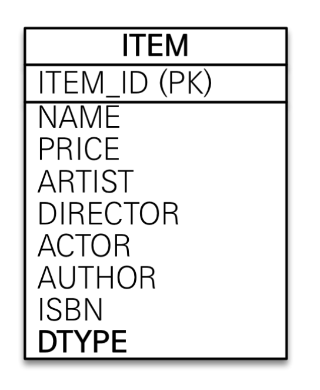

# JPA 고급 매핑

## **👋 목차**

- 상속관계 매핑
- @MappedSuperclass

---

## 상속관계 매핑

- 관계형 데이터베이스는 상속 관계X
- 슈퍼 타입 서브타입 관계라는 모델링 기법이 객체 상속과 유사
- 상속관계 매핑: 객체의 상속과 구조와 DB의 슈퍼타입 서브타입 관계를 매핑
- 슈퍼 타입 서브타입 논리 모델을 실제 물리 모델로 구현하는 방법
    - 각각 테이블로 변환 → 조인 전략
    - 통합 테이블로 변환 → 단일 테이블 전략
    - 서브타입 테이블로 변환 → 구현 클래스마다 테이블 전략

### 주요 어노테이션

- @Inheritance(strategy = inheritanceType.XXX)
    - JOINED: 조인 전략
    - SINGLE_TABLE: 단일 테이블 전략
    - TABLE_PER_CLASS: 구현 클래스마다 테이블 전략
- DiscriminatorColumn(name= "DTYPE")
    - 상위 테이블에 컬럼이 생기고 어떤 엔티티가 들어왔는지 알 수 있다.
- DiscriminatorValue("XXX")
    - 하위 엔티티에서 별칭으로 DTYPE에 들어갈걸 정해 줄 수 있다.

---

### 단일 테이블 전략

기본 전략이 SINGLE_TABLE  아래의 코드 실행시 Item 한테이블에 모든 컬럼이 들어감

- 장점
    - 조인이 필요 없으므로 일반적으로 조회 성능이 빠름
    - 조회 쿼리가 단순함
- 단점
    - 자식 엔티티가 매핑한 컬럼은 모두 null 허용
    - 단일 테이블에 모든 것을 저장하므로 테이블이 커질 수 있다. 상황에 따라서 조회 성능이 오히려 느려질 수 있다.

```java
@Entity
@Inheritance(strategy = inheritanceType.SINGLE_TABLE)
abstract class Item {
	@Id
	private Long id;
	private String name;
	private int price;
}

@Entity
class Album extends Item {
	private String artist
}

@Entity
class Movie extends Item {
	private String director;
	private String actor;
}

@Entity
class Book extends Item {
	private String author;
	private String isbn;
}
```



---

### 조인 테이블 전략

JOINED 하면 아래 ERD처럼 테이블이 생성됨.

- 장점
    - 테이블 정규화
    - 외래 키 참조 무결성 제약조건 활용가능
    - 저장공간 효율화
- 단점
    - 조회시 조인을 많이 사용, 성능 저하
    - 조회 쿼리가 복잡함.
    - 데이터 저장시 INSERT SQL 2번 호출

```java
@Entity
@Inheritance(strategy = inheritanceType.JOINED)
abstract class Item {
	@Id
	private Long id;
	private String name;
	private int price;
}

@Entity
class Album extends Item {
	private String artist
}

@Entity
class Movie extends Item {
	private String director;
	private String actor;
}

@Entity
class Book extends Item {
	private String author;
	private String isbn;
}
```


```

MOVE 로 save 시

insert item values ? ? ?
insert move values ? ? ? 이렇게 들어간다.

```

---

### 구현 클래스마다 테이블 전략

- 이 전략은 데이터베이스 설계자와 ORM 전문가 둘 다 추천 X
- 장점
    - 서브 타입을 명확하게 구분해서 처리 할 때 효과적
    - not null 제약조건 사용 가능
- 단점
    - 여러 자식 테이블을 함께 조회할 때 성능이 느림(UNION SQL 필요)
    - 자식 테이블을 통합해서 쿼리하기 어려움

```java
@Entity
@Inheritance(strategy = inheritanceType.TABLE_PER_CLASS)
abstract class Item {
	@Id
	private Long id;
	private String name;
	private int price;
}

@Entity
class Album extends Item {
	private String artist
}

@Entity
class Movie extends Item {
	private String director;
	private String actor;
}

@Entity
class Book extends Item {
	private String author;
	private String isbn;
}
```


---

## MappedSuperclass

- 공통 매핑 정보 가 필요할 때 사용(id, name)

```java
@MpaaedSuperclass
class BaseEntity {
	LocalDateTime create;
	LocalDateTime update;
}

class Member extends BaseEntity {

}

```


- 상속관계 매핑X
- 엔티티X, 테이블과 매핑X
- 부모 클래스를 상속받는 자식 클래스에 매핑 정보만 제공
- 조회, 검색불가(em.find(BaseEntity)불가
- 직접 생성해서 사용할 일이 없으므로 추상 클래스 권장
- 테이블과 관계 없고, 단순히 엔티티가 공통으로 사용하는 매핑 정보를 모으는 역할
- 주로 등록일, 수정일, 등록자, 수정자 같은 전체 엔티티에서 공통으로 적용하는 정보를 모을 때 사용
- 참고: @Entity 클래스는 엔티티나 @MappedSuperclass로 지정한 클래스만 상속 가능