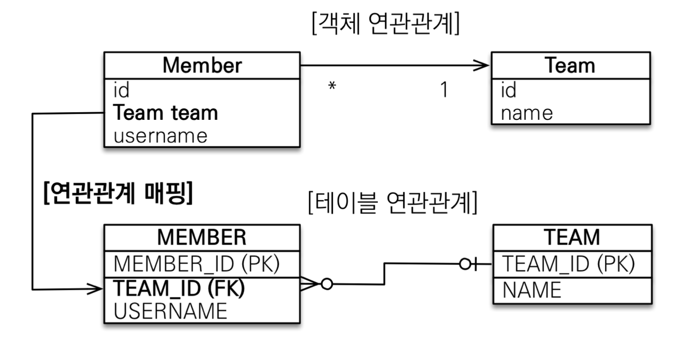

# JPA 다양한 연관관계 매핑

## **👋 목차**

- 연관관계 매핑시 고려사항 3가지
- 다대일 [N:1]
- 일대다 [1:N]
- 일대일 [1:1]
- 다대다 [N:M]

---

## 연관관계 매핑 시 고려사항 3가지

### 다중성

- 다대일: @ManyToOne
- 일대다: @OneToMany
- 일대일: @OneToOne
- 다대다: @ManyToMany

> DB 와 연동하기 위한 매핑 DB 기준으로 생각해보자.
> 

---

 

### 다대일

다에 외래키가 간다 클래스로 보면

```java
class Member {
	...//
	@ManyToOne
	Team team;
}
```



- 가장 많이 사용하는 연관관계
- 다대일의 반대는 일대다

---

### 다대일 양방향

```java
class Member {
	..///code
	@ManyToOne
	Team team;
}

class Team {
	..//

	@OneToMany(mappedBy = "team")
	ArrayList<Member> members = new ArrayList<>();
	
}
```


- 외래 키가 있는 쪽이 연관관계의 주인
- 양쪽을 서로 참조하도록 개발

---

### 일대다

Team이 관리한다 하지만 테이블은 그대로 객체만 변한다.

Team이 Member를 관리하고있다

```java

@Entity
class Team {
	..//

	@OneToMnay
	@JoinColumn(name = "TEAM_ID")
	private List<Member> members = new ArrayList<>();
}

```


- 일대다 단방향은 일대다(1:N)에서 일(1) 이 연관관계의 주인
- 테이블 일대다 관계는 항상 다(N) 쪽에 외래 키가 있음
- 객체와 테이블의 차이 때문에 반대편 테이블의 외래 키를 관리하는 특이한 구조
- @JoinColumn을 꼭 사용해야 함. 그렇지 않으면 조인 테이블 방식을 사용함(중간에 테이블을 하나 추가함)
- 일대다 단방향 매핑의 단점
    - 엔티티가 관리하는 외래 키가 다른 테이블에 있음
    - 연관관계 관리를 위해 추가로 UPDATE SQL 실행
    

**일대다 단방향 매핑보다는 다대일 양방향 매핑을 사용하자**

---

### 일대다 양방향

사용하지 말자..!

```java
@Entity
class Team {
	..//

	@OneToMnay
	@JoinColumn(name = "TEAM_ID")
	private List<Member> members = new ArrayList<>();
}

@Entity
class Member {
	..//
	
	@ManyToOne
	@JoinColumn(name = "TEAM_ID", insertable = false, updatable = false)
	private Team team;
}
```


- 이런 매핑은 공식적으로 존재 X
- @JoinColumn(insertable = false, updatable = false )
- 읽기 전용 필드를 사용해서 양방향 처럼 사용하는 방법
- **다대일 양방향을 사용하자**

---

### 일대일 [1:1]

- 일대일 관계는 그 반대도 일대일
- 주 테이블이나 대상 테이블 중에 외래 키 선택 가능
    - 주 테이블에 외래 키
    - 대상 테이블에 외래 키
- 외래 키에 데이터베이스 유니크(UNI) 제약조건 추가

```java
class Member {
	@Id
	private Long id;
		
	@OneToOne
	@JoinColumn(name = "LOCKER_ID")
	private Locker locker;

	private String username;
}

class Locker {
	,,,,.
}

//////////////////////////

// 양방향

class Member {
	@Id
	private Long id;
		
	@OneToOne
	@JoinColumn(name = "LOCKER_ID")
	private Locker locker;

	private String username;
}

class Locker {
	,,,,.

	@OneToOne(mappedBy...
}
```


- 다대일 (@ManyToOne) 단방향 매핑과 유사

양방향

- 다대일 양방향 매핑 처럼 외래 키가 있는 곳이 연관관계의 주인
- 반대편은 mappedBy 적용

### **정리**

- 주 테이블에 외래 키
    - 주 객체가 대상 객체의 참조를 가지는 것처럼 주 테이블에 외래 키를 두고 대상 테이블을 찾음
    - 객체지향 개발자 선호
    - JPA 매핑 편리
    - 장점: 주 테이블만 조회해도 대상테이블에 데이터가 있는지 확인 가능
    - 단점: 값이 없으면 외래 키에 null 허용
- 대상 테이블에 외래 키
    - 대상 테이블에 외래 키가 존재
    - 전통적인 데이터베이스 개발자 선호
    - 장점: 주 테이블과 대상 테이블을 일대일에서 일대다 관계로 변경할 때 테이블 구조 유지
    - 단점: 프록시 기능의 한계로 **지연 로딩으로 설정해도 항상 즉시 로딩됨**

---

### 다대다[N:M]

- 관계형 데이터 베이스는 정규화된 테이블 2개로 다대다 관계를 표현할 수 없음
- 연결 테이블을 추가해서 일대다, 다대일 관계로 풀어내야함


- 객체는 컬렉션을 사용해서 객체2개로 다대다 관계 가능


- @ManyToMany 사용
- @JoinTable로 연결 테이블 지정
- 다대다 매핑: 단방향, 양방향 가능

```java
class Member {
	
	@ManyToMany
	@JoinTable(name = "MEMEBER_PRODUCT")
	private List<Product> products = new ArrayList<>();

}

class Product {
		@Id
		private Long id;
.../
}

// 양방향

class Member {
	
	@ManyToMany
	@JoinTable(name = "MEMEBER_PRODUCT")
	private List<Product> products = new ArrayList<>();

}

class Product {
		@Id
		private Long id;
		
		@ManyToMany(mappedBy = "products")
		private List<Member> members = new ArrayList<>();

}
```

### **다대다 매핑의 한계**

- 편리해 보이지만 실무에서 사용X
- 연결 테이블이 단순히 연결만 하고 끝나지 않음
- 주문시간, 수량 같은 데이터가 들어올 수 있음

### 다대다 한계 극복

- 연결 테이블용 엔티티 추가(**연결 테이블을 엔티티로 승격**)
- @ManyToMany → @OneToMany, @ManyToOne