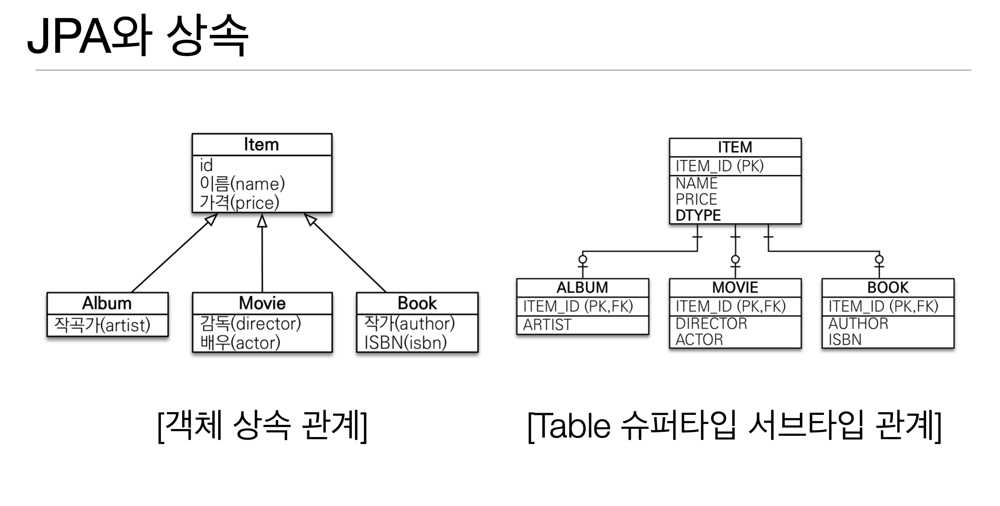

# JPA 소개

---

## JPA?

- Java Persistence API
- 바자 진영의 ORM 기술 표준

---

## ORM?

- Object-relational mapping (객체 관계 매핑)
- 객체는 객체대로 설계
- 관계형 데이터베이스는 관계형 데이터베이스대로 설계
- ORM 프레임워크가 중간에서 매핑
- 대중적인 언어는 대부분 ORM 기술이 존재

---

## JPA를 왜 사용해야 하는가?

- SQL 중심적인 개발에서 객체 중심으로 개발
- 생산성
- 유지보수
- 패러다임의 불일치 해결
- 성능
- 데이터 접근 추상화와 벤더 독립성
- 표준

### 생산성 - JPA와 CRUD

정말 간단해지는 CRUD

- 저장: jpa.persist(member)
- 조회: Member member = jpa.find(memberId)
- 수정: member.setName("변경할 이름")
- 삭제: jpa.remove(member)

## 유지보수

Member 에서 Tel 이 빠진다면 기존 mybatis 같은 경우 모든 쿼리를 변경해야 겠지만

JPA를 사용한다면 매번 쿼리를 수정할 필요 없이 Entity 만 수정해도된다.

```java
public class Member {
	private String memberId;
	private String name;
	private String tel;
}

INSERT INTO MEMBER(MEMBER_ID, NAME, TEL) VALUES...
```

## 패러다임의 불일치 해결

기존의 mybatis처럼 매번 매핑하거나 null 체크를 할 필요없이 jpa가 해결해줌




## 지연 로딩과 즉시 로딩

- 지연 로딩: 객체가 실제 사용될 때 로딩
- 즉시 로딩: JOIN SQL 로 한번에 연관된 객체까지 미리 조회

```java
// 지연
Member member = memberDAO.find(memberId); 
Team team = member.getTeam();
String teamName = team.getName();

//Query
SELECT * FROM MEMBER ....
SELECT * FROM TEAM ...

객체가 사용될떄 쿼리를 날림

```

```java
//즉시
Member member = memberDAO.find(memberId); 
Team team = member.getTeam();
String teamName = team.getName();

//Query
SELECT M.* , T.* FROM MEMBER JOIN TEAM...

미리 조회
```