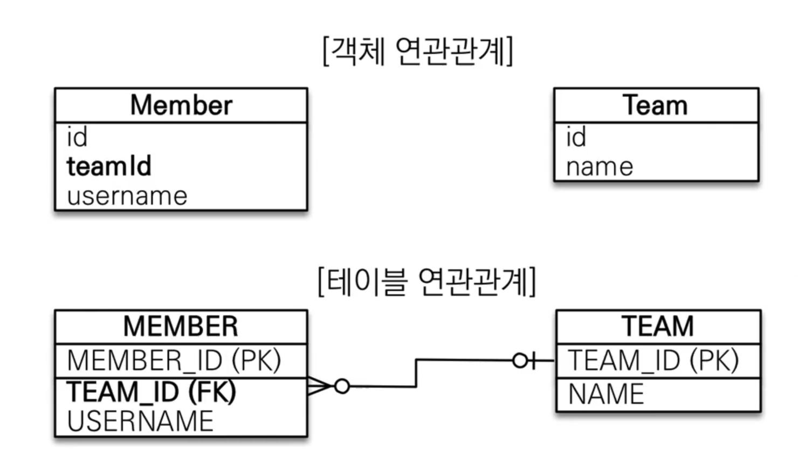

# JPA 연관관계 매핑

## 👋 목차

- 연관관계가 필요한 이유
- 단방향 연관관계
- 양방향 연관관계와 연관관계의 주인

---

## 연관 관계 매핑

### **목표**

- 객체와 테이블 연관관계의 차이를 이해
- 객체의 참조와 테이블의 외래 키를 매핑

### **용어**

- 방향(Direction): 단방향, 양방향
- 다중성(Multiplicity): 다대일(N:1), 일대다(1:N), 일대일(1:1), 다대다(N:M)
- 연관관계의 주인(OWNER): 객체 양방향 연관관계는 관리 주인이 필요

---

### 예제 시나리오

- 회원과 팀이 있다.
- 회원은 하나의 팀에만 소속될 수 있다.
- 회원과 팀은 다대일 관계다.

### 객체를 테이블에 맞추어 모델링

(연관관계가 없는 객체)



```java

@Entity
class Member {
	@Id @GenerateValud
	private Long id;
	
	@Column(name = "USERNAME")
	pirvate String username;

	@Column(name = "TEAM_ID")
	private Long teamId;
}

@Entity
class Team {
	@Id @GenerateValue
	@Column(name = "TEAM_ID")
	private Long id;
	private String name;	

}

```

위처럼 하게되면 2번의 쿼리를 날려야한다

객체를 테이블에 맞추어 데이터 중심으로 모델링하면, 협력 관게를 만들 수 없다

- 테이블은 외래 키로 조인을 사용해서 연관된 테이블을 찾는다.
- 객체는 참조를 사용해서 연관된 객체를 찾는다.
- 테이블과 객체 사이에는 이런 큰 간격이 있다.

---

## 단 방향 연관관계


```java
@Entity
class Member {
	@Id @GenerateValud
	private Long id;
	
	@Column(name = "USERNAME")
	pirvate String username;

	@ManyToOne
	@JoinColumn(name = "TEAM_ID")
	private Team team;

}

@Entity
class Team {
	@Id @GenerateValue
	@Column(name = "TEAM_ID")
	private Long id;
	private String name;	

}
```

- @ManyToOne
    - 다대일(N:1) 관계라는 매핑 정보이다.
    - 회원과 팀은 다대일 관계이다.
    - 연관관계를 매핑 시 다중성을 나타내는 어노테이션 필수
- @JoinColumn(name="TEAM_ID")
    - 조인 컬럼은 외래 키를 매핑할 때 사용.
    - 생략 가능
    - name 속성에는 매핑할 외래 키 이름을 지정한다.
    - 회원과 팀 테이블은 TEAM_ID 외래 키로 연관관계를 맺으므로 이 값을 지정하면 된다.
    

---

## 양 방향 매핑

이전 상태를 보면 Member 에서 Team 으로 

getTeam()으로 갈 수 있지만 Team 에서 getMember는 하지 못한다.

DB 에서는 FK 하나로 양 방향으로 조회가 가능하지만

객체에서는 불가능

**예제**


테이블 연관관계는 이전과 동일 ( 단 방향 )

```java
@Entity
class Member {
	@Id @GenerateValud
	private Long id;
	
	@Column(name = "USERNAME")
	pirvate String username;

	@ManyToOne
	@JoinColumn(name = "TEAM_ID")
	private Team team;

}

@Entity
class Team {
	@Id @GenerateValue
	@Column(name = "TEAM_ID")
	private Long id;
	private String name;	
	
	@OneToMany(mappedBy = "team")
	private List<Member> members = new ArrayList<>();

}
```

- Team 클래스에 List<Member> members = new ArrayList<>(); 선언
- @OneToMany 선언
- mappedBy로 Member 객체의 필드명을 적어준다.

**연관관계의 주인과 mappedBy**

- mappedBy = JPA의 멘탈붕괴 난이도
- 객체와 테이블간에 연관관계를 맺는 차이를 이해해야 함

### **객체와 테이블이 관계를 맺는 차이**

- 객체 연관관계 = 2개
    - 회원 → 팀 연관관계 1개 ( 단방향 )
    - 팀 → 회원 연관관계 1개 ( 단방향 )
- 테이블 연관관계 = 1개
    - 회원 ↔ 팀의 연관관계 1개 ( 양방향 )
    - TEAM_ID (FK) 하나로 조회 가능
    - select * from team t join member m on m.team_id = t.team_id
    

### **객체의 양방향 관계**

- 객체의 양방향 관계는 사실 양방향 관계가 아니라 서로 다른 단방향 관계 2개다.
- 객체를 양방향으로 참조하려면 단방향 연관관계를 2개만들어야 한다

```java
class A {
	B b;
}

class B {
	A a;
}

A -> B (a.getB())
B -> A (b.getA())
```

### 테이블의 양방향 연관관계

- 테이블은 외래 키 하나로 두 테이블의 연관관계를 관리
- MEMBER>TEAM_ID 외래 키 하나로 양방향 연관관계를 가짐 ( 양쪽으로 조인 할 수 있다 )

```sql
select
	*
from member m
join team t on m.team_id = t.team_id

select
	*
from team t
join member m on t.team_id = m.team_id
```

### 연관관계의 주인 ( Owner )

양방향 매핑 규칙

- 객체의 두 관계중 하나를 연관관계의 주인으로 지정
- 연관관계의 주인만이 외래 키를 관리(등록, 수정)
- 주인이 아닌쪽은 읽기만 가능
- 주인은 mappedBy 속성 사용X
- 주인이 아니면 mappedBy속성으로 주인 지정

### **누구를 주인으로?**

- 외래 키가 있는 곳을 주인으로 정해라
- 여기서는 Member.team이 연관관계의 주인


### **양방향 매핑시 가장 많이 하는 실수**

(연관관계의 주인에 값을 입력하지 않음)

```java
Member member = new Member();
member.setName("MemberA");

em.persist(member);

Team team = new Team();
team.setName("TeamA");
team.getMembers().add(member);
em.persist(team);

// 결과
ID username team_id
1. MemberA. null

```

**Team 에서 Members는 읽기전용이다**

### 양방향 매핑시 연관관계의 주인에 값을 입력해야 한다.

(순수한 객체 관계를 고려하면 양쪽다 값을 입력해야 한다.)

```java
Team team = new Team();
team.setName("TeamA");
em.persist(team);

Member member = new Member();
member.setusername("member1");

member.setTeam(team);

team.getMembers().add(member);

em.persist(member);
```

### **양방향 연관관계 주의**

- 순수 객체 상태를 고려해서 항상 양쪽에 값을 설정하자.
- 연관관계 편의 메소드를 생성하자
- 양방향 매핑시에 무한루프를 조심하자
    - 예: toString(0, lombok, JSON 생성 라이브러리
    

---

### 양방향 매핑 정리

- 단방향 매핑만으로도 이미 연관관계 매핑은 완료
- 양방향 매핑은 반대 방향으로 조회(객체 그래프 탐색) 기능이 추가된 것 뿐
- JPQL에서 역방향으로 탐색할 일이 많음
- 단방향 매핑을 잘 하고 양방향은 필요할 때 추가해도됨 ( 테이블에 영향을 주지 않음 )

### 연관관계의 주인을 정하는 기준

- 비즈니스 로직을 기준으로 연관관계의 주인을 선택하면 안됨
- **연관관계의 주인은 외래 키의 위치를 기준으로 정해야함**