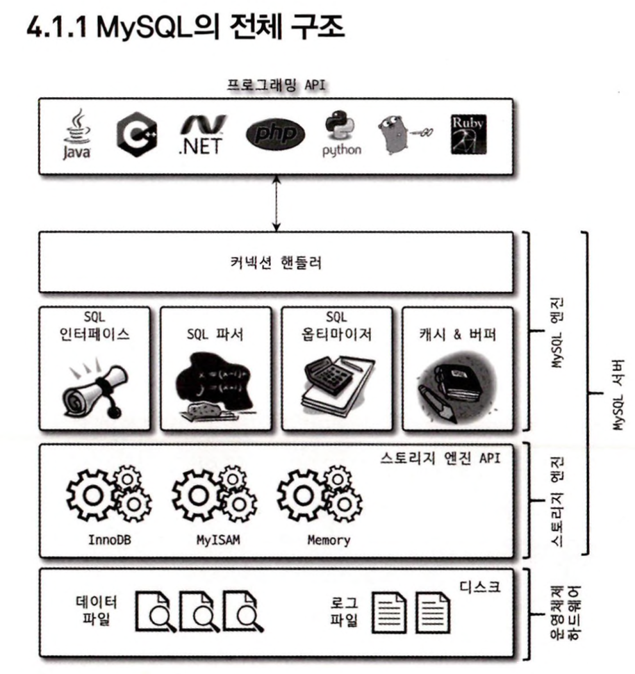

## [노션으로 보면 더욱 보기 편합니다!](https://near-sunscreen-c35.notion.site/4-f58a9be580d644a9bdcace8d6c74ec2b)

# 4장 아키텍처

---

# 4.1 Mysql 엔진 아키텍처

## 4.1.1 Mysql의 전체 구조

- Mysql 서버는 다른 DBMS에 비해 구조가 독특
- 이런 독특한 구조로 엄청난 혜택을 누릴수있음
- 반대로 다른 DBMS에서는 문제되지 않는게 문제가 되기도함



### Mysql 엔진

`Mysql 엔진 중심 구성 및 특징`

- 클라이언트의 접속 및 쿼리 요청을 처리하는 커넥션 핸들러
- SQL 파서 및 전처리기
- 최적화 쿼리를 위한 옵티마이저
- Mysql 은 표준 SQL (ANSI SQL) 지원 타 DBMS에 호환이 가능

### 스토리지 엔진

`스토리지 엔진의 역할 및 특징`

- 실제 데이터를 디스크 스토리지에 저장
- 디스크 스토리지에서 데이터를 읽어오는 부분
- 여러 스토리지 엔진을 동시에 사용할 수 있음

**스토리지 엔진 지정하기**

test_table 은 앞으로 INNODB가 스토리지 엔진으로 담당하게 된다.

```sql
CREATE TABLE test_table(
	id INT,
	id2 INT
) ENGINE=INNODB;
```

### **핸들러 API**

`핸들러 API 란?`

Mysql 엔진의 쿼리 실행기에서 데이터를 쓰거나 읽어야 할 때 각 스토리지 엔진에

읽기 또는 쓰기 요청을 하는데 이러한 요청을 한들러 요청이라고 한다. 

여기서 사용되는 API를 핸들러 API 라고 한다.

**핸들러 API 통해 얼마나 많은 작업이 있었는지를 보는 명령**

```sql
mysql> show global status like 'Handler%';
+----------------------------+-------+
| Variable_name              | Value |
+----------------------------+-------+
| Handler_commit             | 585   |
| Handler_delete             | 0     |
| Handler_discover           | 0     |
| Handler_external_lock      | 6121  |
| Handler_mrr_init           | 0     |
| Handler_prepare            | 0     |
| Handler_read_first         | 41    |
| Handler_read_key           | 1706  |
| Handler_read_last          | 0     |
| Handler_read_next          | 4009  |
| Handler_read_prev          | 0     |
| Handler_read_rnd           | 0     |
| Handler_read_rnd_next      | 1334  |
| Handler_rollback           | 0     |
| Handler_savepoint          | 0     |
| Handler_savepoint_rollback | 0     |
| Handler_update             | 317   |
| Handler_write              | 18    |
+----------------------------+-------+
18 rows in set (0.03 sec)
```

---

## 4.1.2 Mysql 스레딩 구조


- Mysql 는 프로세스 기반이 아닌 스레드 기반으로 작동한다
- 포그라운드(Foreground) 스레드
- 백그라운드(Background) 스레드

`Mysql 실행중인 스레드 목록 보기`

```sql
mysql> select thread_id, name, type, processlist_user, processlist_host 
from performance_schema.threads order by type, thread_id;
+-----------+---------------------------------------------+------------+------------------+------------------+
| thread_id | name                                        | type       | processlist_user | processlist_host |
+-----------+---------------------------------------------+------------+------------------+------------------+
|         1 | thread/sql/main                             | BACKGROUND | NULL             | NULL             |
|         3 | thread/innodb/io_ibuf_thread                | BACKGROUND | NULL             | NULL             |
|         4 | thread/innodb/io_log_thread                 | BACKGROUND | NULL             | NULL             |
|         5 | thread/innodb/io_read_thread                | BACKGROUND | NULL             | NULL             |
|         6 | thread/innodb/io_read_thread                | BACKGROUND | NULL             | NULL             |
|         7 | thread/innodb/io_read_thread                | BACKGROUND | NULL             | NULL             |
|         8 | thread/innodb/io_read_thread                | BACKGROUND | NULL             | NULL             |
|         9 | thread/innodb/io_write_thread               | BACKGROUND | NULL             | NULL             |
|        10 | thread/innodb/io_write_thread               | BACKGROUND | NULL             | NULL             |
|        11 | thread/innodb/io_write_thread               | BACKGROUND | NULL             | NULL             |
|        12 | thread/innodb/io_write_thread               | BACKGROUND | NULL             | NULL             |
|        13 | thread/innodb/page_flush_coordinator_thread | BACKGROUND | NULL             | NULL             |
|        14 | thread/innodb/log_checkpointer_thread       | BACKGROUND | NULL             | NULL             |
|        15 | thread/innodb/log_flush_notifier_thread     | BACKGROUND | NULL             | NULL             |
|        16 | thread/innodb/log_flusher_thread            | BACKGROUND | NULL             | NULL             |
|        17 | thread/innodb/log_write_notifier_thread     | BACKGROUND | NULL             | NULL             |
|        18 | thread/innodb/log_writer_thread             | BACKGROUND | NULL             | NULL             |
|        23 | thread/innodb/srv_lock_timeout_thread       | BACKGROUND | NULL             | NULL             |
|        24 | thread/innodb/srv_error_monitor_thread      | BACKGROUND | NULL             | NULL             |
|        25 | thread/innodb/srv_monitor_thread            | BACKGROUND | NULL             | NULL             |
|        26 | thread/innodb/buf_resize_thread             | BACKGROUND | NULL             | NULL             |
|        27 | thread/innodb/srv_master_thread             | BACKGROUND | NULL             | NULL             |
|        28 | thread/innodb/dict_stats_thread             | BACKGROUND | NULL             | NULL             |
|        29 | thread/innodb/fts_optimize_thread           | BACKGROUND | NULL             | NULL             |
|        30 | thread/mysqlx/worker                        | BACKGROUND | NULL             | NULL             |
|        31 | thread/mysqlx/worker                        | BACKGROUND | NULL             | NULL             |
|        32 | thread/mysqlx/acceptor_network              | BACKGROUND | NULL             | NULL             |
|        36 | thread/innodb/buf_dump_thread               | BACKGROUND | NULL             | NULL             |
|        37 | thread/innodb/clone_gtid_thread             | BACKGROUND | NULL             | NULL             |
|        38 | thread/innodb/srv_purge_thread              | BACKGROUND | NULL             | NULL             |
|        39 | thread/innodb/srv_worker_thread             | BACKGROUND | NULL             | NULL             |
|        40 | thread/innodb/srv_worker_thread             | BACKGROUND | NULL             | NULL             |
|        41 | thread/innodb/srv_worker_thread             | BACKGROUND | NULL             | NULL             |
|        43 | thread/sql/signal_handler                   | BACKGROUND | NULL             | NULL             |
|        44 | thread/mysqlx/acceptor_network              | BACKGROUND | NULL             | NULL             |
|        42 | thread/sql/event_scheduler                  | FOREGROUND | event_scheduler  | localhost        |
|        46 | thread/sql/compress_gtid_table              | FOREGROUND | NULL             | NULL             |
|        47 | thread/sql/one_connection                   | FOREGROUND | root             | 172.17.0.1       |
|        48 | thread/sql/one_connection                   | FOREGROUND | root             | localhost        |
+-----------+---------------------------------------------+------------+------------------+------------------+
39 rows in set (0.01 sec)
```

많은 스레드 중에서 `thread/sql/one_connection` 스레드만 실제 사용자의 요청을 처리하는 스레드다.

### 4.1.2.1 포그라운드 스레드( 클라이언트 스레드 )

`Mysql 포그라운드 스레드 특징`

- 포그라운드 스레드는 최소한 Mysql 서버에 접속된 클라이언트 수만큼 존재
- 주로 클라이언트 사용자가 요청하는 쿼리 문장을 처리함
- 클라이언트의 작업을 마치고 커넥션을 종료하면 스레드 캐시로 되돌아감
- 유지할 수 있는 최대 스레드 개수는 thread_cache_size 시스템 변수로 설정

`Mysql 포그라운드 스레드 역할`

- 데이터를 Mysql의 데이터 버퍼나 캐시로부터 가져옴
- 캐시에 없는경우 직접 디스크의 데이터나 인덱스 파일로부터 데이터를 가져와 작업
- InnoDB 테이블은 데이터 버퍼나 캐시까지만 포그라운드가 처리 나머지 버퍼로부터 디스크까지 기록은 백그라운드 스레드가 처리함

### 4.1.2.2 백그라운드 스레드

MyISAM의 경우 별로 해당이 없지만 InnoDB는 다음 작업들이 백그라운드로 처리됨

`InnoDB 처리`

- 인서트 버퍼를 병합하는 스레드
- 로그를 디스크로 기록하는 스레드
- InnoDB 버퍼 풀의 데이터를 디스크에 기록하는 스레드
- 데이터를 버퍼로 읽어 오는 스레드
- 잠금이나 데드락을 모니터링 하는 스레드

`중요한 스레드`

- Log Thread와 버퍼 데이터를 디스크로 내려쓰는 처리하는 Write Thread
- Mysql 5.5 버전 부터 데이터 쓰기와 데이터 읽기 스레드의 개수를 2개 이상 지정 할 수 있다.
    
    Innodb_write_io_threads , innodb_read_io_threads 시스템 변수
    

---

## 4.1.3 메모리 할당 및 사용 구조


### 4.1.3.1 글로벌 메모리 영역

클라이언트 스레드 수와 무관하게 하나의 메모리 공간만 할당된다.

필요에 따라 2개 이상의 메모리 공간을 할당받을 수도 있지만 클라이언트의 스레드 수와는 무관하다.

`대표적인 글로벌 메모리 영역`

- 테이블 캐시
- InnoDB 버퍼 풀
- InnoDB 어댑티브 해시 인덱스
- InnoDB 리두 로그 버퍼

### 4.1.3.2 로컬 메모리 영역

`로컬 메모리 영역이란?`

- 세션 메모리 영역이라고도 표현하며 클라이언트 스레드가 쿼리를 처리하는 메모리 영역이다.
- 클라라이언트와 Mysql 서버와의 커넥션을 세션이라고 하기 때문에 로컬 메모리 영역을 세션 영역이라고도 함

`대표적인 로컬 메모리 영역`

- 정렬 버퍼(Sort buffer)
- 조인 버퍼
- 바이너리 로그 캐시
- 네트워크 버퍼

---

## 4.1.4 플러그인 스토리지 엔진 모델

지금까지 나온 스토리지 엔진중 MyISAM 이나 InnoDB 스토리지 엔진 가운데

뭘 사용하든 차이가 없는가 생각 할 수 있다. 

이번 장에서는 `하나의 쿼리 작업은 하위 작업으로 나뉘는데. 각 하위 작업이 어떤 영역에서 처리되는지 알아야 함`

`지원하는 스토리 엔진 종류 확인하기`

```sql
mysql> show engines;
+--------------------+---------+----------------------------------------------------------------+--------------+------+------------+
| Engine             | Support | Comment                                                        | Transactions | XA   | Savepoints |
+--------------------+---------+----------------------------------------------------------------+--------------+------+------------+
| FEDERATED          | NO      | Federated MySQL storage engine                                 | NULL         | NULL | NULL       |
| MEMORY             | YES     | Hash based, stored in memory, useful for temporary tables      | NO           | NO   | NO         |
| InnoDB             | DEFAULT | Supports transactions, row-level locking, and foreign keys     | YES          | YES  | YES        |
| PERFORMANCE_SCHEMA | YES     | Performance Schema                                             | NO           | NO   | NO         |
| MyISAM             | YES     | MyISAM storage engine                                          | NO           | NO   | NO         |
| MRG_MYISAM         | YES     | Collection of identical MyISAM tables                          | NO           | NO   | NO         |
| BLACKHOLE          | YES     | /dev/null storage engine (anything you write to it disappears) | NO           | NO   | NO         |
| CSV                | YES     | CSV storage engine                                             | NO           | NO   | NO         |
| ARCHIVE            | YES     | Archive storage engine                                         | NO           | NO   | NO         |
+--------------------+---------+----------------------------------------------------------------+--------------+------+------------+
9 rows in set (0.01 sec)
```

`Support 칼럼 값`

- YES: Mysql 서버에 해당 스토리지 엔진이 포함돼 잇고, 사용가능으로 활성화된 상태
- DEFAULT: YES 와 동일한 상태이지만 필수 스토리지 엔진임을 의미 (이 엔진이 없으면 서버 실행 불가 할수도 있음)
- NO: 현재 서버에 포함되지 않았음을 의미
- DISABLED: 현재 서버에는 포함 됐지만 파라미터에 의해 비활성화된 상태

`플러그인 확인하기`

```sql
mysql> show plugins;
+---------------------------------+----------+--------------------+---------+---------+
| Name                            | Status   | Type               | Library | License |
+---------------------------------+----------+--------------------+---------+---------+
| binlog                          | ACTIVE   | STORAGE ENGINE     | NULL    | GPL     |
| mysql_native_password           | ACTIVE   | AUTHENTICATION     | NULL    | GPL     |
| sha256_password                 | ACTIVE   | AUTHENTICATION     | NULL    | GPL     |
| caching_sha2_password           | ACTIVE   | AUTHENTICATION     | NULL    | GPL     |
| sha2_cache_cleaner              | ACTIVE   | AUDIT              | NULL    | GPL     |
| daemon_keyring_proxy_plugin     | ACTIVE   | DAEMON             | NULL    | GPL     |
| CSV                             | ACTIVE   | STORAGE ENGINE     | NULL    | GPL     |
| MEMORY                          | ACTIVE   | STORAGE ENGINE     | NULL    | GPL     |
| InnoDB                          | ACTIVE   | STORAGE ENGINE     | NULL    | GPL     |
| INNODB_TRX                      | ACTIVE   | INFORMATION SCHEMA | NULL    | GPL     |
| INNODB_CMP                      | ACTIVE   | INFORMATION SCHEMA | NULL    | GPL     |
| INNODB_CMP_RESET                | ACTIVE   | INFORMATION SCHEMA | NULL    | GPL     |
| INNODB_CMPMEM                   | ACTIVE   | INFORMATION SCHEMA | NULL    | GPL     |
| INNODB_CMPMEM_RESET             | ACTIVE   | INFORMATION SCHEMA | NULL    | GPL     |
| INNODB_CMP_PER_INDEX            | ACTIVE   | INFORMATION SCHEMA | NULL    | GPL     |
| INNODB_CMP_PER_INDEX_RESET      | ACTIVE   | INFORMATION SCHEMA | NULL    | GPL     |
| INNODB_BUFFER_PAGE              | ACTIVE   | INFORMATION SCHEMA | NULL    | GPL     |
| INNODB_BUFFER_PAGE_LRU          | ACTIVE   | INFORMATION SCHEMA | NULL    | GPL     |
| INNODB_BUFFER_POOL_STATS        | ACTIVE   | INFORMATION SCHEMA | NULL    | GPL     |
| INNODB_TEMP_TABLE_INFO          | ACTIVE   | INFORMATION SCHEMA | NULL    | GPL     |
| INNODB_METRICS                  | ACTIVE   | INFORMATION SCHEMA | NULL    | GPL     |
| INNODB_FT_DEFAULT_STOPWORD      | ACTIVE   | INFORMATION SCHEMA | NULL    | GPL     |
| INNODB_FT_DELETED               | ACTIVE   | INFORMATION SCHEMA | NULL    | GPL     |
| INNODB_FT_BEING_DELETED         | ACTIVE   | INFORMATION SCHEMA | NULL    | GPL     |
| INNODB_FT_CONFIG                | ACTIVE   | INFORMATION SCHEMA | NULL    | GPL     |
| INNODB_FT_INDEX_CACHE           | ACTIVE   | INFORMATION SCHEMA | NULL    | GPL     |
| INNODB_FT_INDEX_TABLE           | ACTIVE   | INFORMATION SCHEMA | NULL    | GPL     |
| INNODB_TABLES                   | ACTIVE   | INFORMATION SCHEMA | NULL    | GPL     |
| INNODB_TABLESTATS               | ACTIVE   | INFORMATION SCHEMA | NULL    | GPL     |
| INNODB_INDEXES                  | ACTIVE   | INFORMATION SCHEMA | NULL    | GPL     |
| INNODB_TABLESPACES              | ACTIVE   | INFORMATION SCHEMA | NULL    | GPL     |
| INNODB_COLUMNS                  | ACTIVE   | INFORMATION SCHEMA | NULL    | GPL     |
| INNODB_VIRTUAL                  | ACTIVE   | INFORMATION SCHEMA | NULL    | GPL     |
| INNODB_CACHED_INDEXES           | ACTIVE   | INFORMATION SCHEMA | NULL    | GPL     |
| INNODB_SESSION_TEMP_TABLESPACES | ACTIVE   | INFORMATION SCHEMA | NULL    | GPL     |
| MyISAM                          | ACTIVE   | STORAGE ENGINE     | NULL    | GPL     |
| MRG_MYISAM                      | ACTIVE   | STORAGE ENGINE     | NULL    | GPL     |
| PERFORMANCE_SCHEMA              | ACTIVE   | STORAGE ENGINE     | NULL    | GPL     |
| TempTable                       | ACTIVE   | STORAGE ENGINE     | NULL    | GPL     |
| ARCHIVE                         | ACTIVE   | STORAGE ENGINE     | NULL    | GPL     |
| BLACKHOLE                       | ACTIVE   | STORAGE ENGINE     | NULL    | GPL     |
| FEDERATED                       | DISABLED | STORAGE ENGINE     | NULL    | GPL     |
| ngram                           | ACTIVE   | FTPARSER           | NULL    | GPL     |
| mysqlx_cache_cleaner            | ACTIVE   | AUDIT              | NULL    | GPL     |
| mysqlx                          | ACTIVE   | DAEMON             | NULL    | GPL     |
+---------------------------------+----------+--------------------+---------+---------+
45 rows in set (0.02 sec)
```

---

## 4.1.5 컴포넌트

8.0 버전부터 기존의 플러그인을 대처하기 위해 컴포넌트가 추가됨

`컴포넌트 플러그인의 단점을 보완해줌`

- 플러그인은 오직 Mysql 서버와 인터페이스할 수 있고, 플로그인 끼리는 통신할 수 없음
- 플러그인은 Mysql 서버의 변수나 함수를 직접 호출하기 때문에 안전하지 않음(캡슐화 안됨)
- 플러그인은 상호 의존 관계를 설정할 수 없어서 초기화가 어려움

---

## 4.1.6 쿼리 실행 구조


### 4.1.6.1 쿼리 파서

- 사용자 요청으로 들어온 쿼리 문장을 토큰 (Mysql 이 인식할 수 있는 최소 단위의 어휘나 기호) 로 분리해 트리 형태의 구조로 만들어 내는 작업을 함
- 쿼리 문장의 기본 문법 오류는 쿼리파서에서 발견되고 사용자에게 오류  메시지를 전달하게 됨

### 4.1.6.1 전 처리기

- 파서 과정에서 만들어진 파서 트리를 기반으로 쿼리 문장에 구조적인 문제점을 파악
- 각 토큰을 테이블 이름이나 칼럼 이름, 또는 내장함수 같은 객체에 매핑함
- 객체 존재 여부와 객체의 접근 권한등을 전 처리에서 처리함

### 4.1.6.3 옵티마이저

- 사용자의 쿼리를 저렴한 비용으로 가장 빠르게 처리할지를 결정함 ( DBMS 의 두뇌 )

### 4.1.6.4 실행 엔진

옵티마이저가 두뇌라면 실행 엔진은 손과발에 비유 가능

`옵티마이저가 GROUP BY를 처리하기 위해 임시 테이블을 사용하기로 결정했을 경우의 예시`

1. 실행 엔진이 핸들러에게 임시 테이블을 만들라고 요청
2. 다시 실행 엔진은 WHERE 절에 일치하는 레코드를 읽어오라고 핸들러에게 요청
3. 읽어온 레코드들을 1번에서 준비한 임시 테이블로 저장하라고 다시 핸들러에게 요청
4. 데이터가 준비된 임시 테이블에서 필요한 방식으로 데이터를 읽어 오라고 핸들러에게 요청
5. 최종적으로 실행 엔진은 결과를 사용자나 다른 모듈로 넘김

**실행 엔진은 만들어진 계획대로 각 핸들러에게 요청하고 받은 결과를 다른 핸들러에게 요청하는 연결 역할을 수행**

### 4.1.6.5 핸들러( 스토리지 엔진 )

- 핸들러는 Mysql 서버의 가장 밑단에서 실행 엔진의 요청에 따라 데이터를 디스크로 저장하고 읽어오는 역할을 담당
- 핸들러는 결국 스토리지 엔진을 의미함
- MyISAM 테이블을 조작하는 경우에는 핸들러가 MySIAM 핸들러가됨
- InnoDB 테이블을 조작하는 경우에는 핸들러가 InnoDB 스토리지 엔진이 됨

---

## 4.2 InnoDB 스토리지 엔진 아키텍처


### 4.2.1 프라이머리 키에 의한 클러스터링

`InnoDB 기준`

- 모든 테이블은 프라이머리 키를 기준으로 클러스터링 되어 저장됨 ( 프라이머리 키 값의 순서대로 디스크에 저장)
- 모든 세컨더리 인덱스는 레코드의 주소 대신 프라이머리 키의 값을 논리적인 주소로 사용
- 프라이머리 키가 클러스터링 인덱스이기에 프라이머리 키를 이용한 레인지 스캔은 빨리 처리됨
- 쿼리 실행 계획에서 프라이머리 키가 다른 보조 인덱스보다 비중이 높게 선택됨
- MyISAM 에서는 클러스터링 키를 지원안함

### 4.2.2 외래 키 지원

외래 키에 대한 지원은 InnoDB 스토리지 엔진 레벨에서 지원한다.

`외래키에 얽혀서 긴급하게 작업해야할걸 못할경우 대처방안 foreign-key-check off`

```sql
SET foreign_key_checks=OFF;

-- 작업 후

SET foreign_key_checks=ON;
```

- 작업 후 반드시 다시 정합성을 맞추고 체크를 ON 으로 변경
- 해당 옵션은 세션 및 글로벌로 설정이 가능하므로 꼭 세션을 명시하자

```sql
SET foreign_key_checks=OFF; -- GLOBAL
SET SESSION foreign_key_checks=OFF; -- SESSION
```

### 4.2.3 MVCC(Multi Version Concurrency Control)

- 일반적으로 레코드 레벨의 트랜잭션을 지원하는 DBMS 들이 제공하는 기능
- 잠금을 사용하지 않는 일관된 읽기를 제공하는 목적
- 멀티 버전이라 함은 하나의 레코드에 대해 여러 개이 버전이 동시에 관리된다는 의미

`READ_COMMITTED 기준`

아래 테이블로 INSERT 후 UPDATE 발생하는 작업 절차를 확인해보자

```sql
create table member
(
    m_id   INT          NOT NULL,
    m_name VARCHAR(20) NOT NULL,
    m_area VARCHAR(100) NOT NULL,
    PRIMARY KEY (m_id),
    INDEX ix_area (m_area)
);
INSERT INTO member (m_id, m_name, m_area) VALUES (12, '홍길동', '서울');
commit;
```

INSERT 문 실행되면 데이터베이스의 상태는 아래와 같이 된다.


member 테이블에 Update 문장이 실행 될 때의 처리 절차

```sql
UPDATE member SET m_area='경기' WHERE m_id=12;
```


- UPDATE 문장이 실행되면 커밋 실행 여부와 관계없이 InnoDB의 버퍼 풀은 경기로 변경
- 디스크 데이터 파일에는 체크포인트나 InnoDB 의 Write 스레드에 의해 새로운 값으로 업데이트돼 있을 수도 있고 아닐수도 있음 ( InnoDB가 ACID를 보장하기 때문에 일반적으로 버퍼 풀과 데이터 파일은 동일한 상태라고 가정해도 무방 )

이 상태에서 아직 COMMIT 나 ROLLBACK이 되지 않은 상태에 다른 사용자가 조회를 하면 어디에 있는 데이터를 조회할가?

답은 Mysql 서버의 `시스템 변수(transaction_isolaction)에 설정된 격리수준 레벨에 따라 다르다`

- READ_UNCOMMITTED :
    
     버퍼 풀이나 데이터 파일로부터 변경된 데이터를 읽어서 반환
    
- READ_COMMITTED 나 그이상 :
    
     아직 커밋되지 않았기 때문에 변경되기 이전에 내용을 보관 하고 있는 언두 영역의 데이터를 반환
    

- UPDATE 가 COMMIT 현재 상태를 영구적인 데이터로 만듦
    - 커밋이 된다고 언두 백업 데이터가 항상 바로 삭제되지 않음 언두영역을 필요로 하는 트랜잭션이 더는 없을 때 비로소 삭제됨
- ROLLBACK 하면 언두 영역 데이터를 버퍼 풀로 복구하고 언두 내용을 삭제

### 4.2.4 잠금 없는 일관된 읽기(Non-Locking Consistent Read)

- InnoDB 스토리지 엔진은 MVCC 기술을 이용해 잠금을 걸지 않고 읽기 가능
- SERIALIZABLE 아닌 나머지 격리 레벨은 다른 트랜잭션 작업과 관계 없이 데이터를 언두 로그에서 읽는다.
- 주의 오랜 시간 동완 활성 상태 트랜잭션으로 서버가 느려질 수 있다 일관된 읽기를 위한 언두 로그를 제거하지 못해서 이기 때문에 최대한 빠르게 커밋이나 롤백을 진행해 줘야 한다.


### 4.2.5 자동 데드락 감지

InnoDB 스토리 엔진이 내부적으로 잠금이 교착 상태에 빠지지 않았는지 체크하기 위해

잠금 대기 목록을 그래프 형태로 관리함

`자동 데드락 감지 작업`

- InnoDB 엔진이 데드락 감지 스레드로 주기적으로 잠금 대기 그래프를 검사해 트랜잭션을 찾아 중지함
  - 트랜잭션의 언두 로그양이 가장 많은 것을 종료시킴
  - 언두 로그 레코드를 더 적게 가진 트랜잭션은 롤백됨

**InnoDB 스토리 엔진은 상위 레이어 엔진에서 관리되는 테이블 잠금은 볼수가 없다.**

`데드락 관련 시스템 변수들`

- innodb_table_locks

  스토리 엔진 내부의 레코드 잠금 및 테이블 레벨의 잠금까지 감지할 수 있음

- innodb_deadlock_detect

  OFF 설정시 더이상 데드락 감지 스레드가 작동하지 않음

- innodb_lock_wait_timeout

  데드락 상황에서 일정 시간이 지나면 자동 요청 실패 및 에러 메시지 반환 시간설정

  deadlock_deect OFF 상태면 50초보다 아래로 설정 하는것을 권장


### 4.2.9 언두 로그

InnoDB 스토리지 엔진은 트랜잭션과 격리 수준을 보장하기 위해

DML 로 변경 되기 이전 버전의 데이터를 별도로 백업한다 ( 언두 로그 )

`언두 로그 사용`

- 트랜잭션 보장

  트랜잭션이 롤백 되면 트랜잭션 도중 변경된 데이터를 변경 전 데이터로 복구해야 하는데, 이때 언두 로그에 백업해둔 이전 버전의 데이터를 이용해 복구한다

- 격리 수준 보장

  특정 커넥션에서 데이터를 변경하는 도중에 다른 커넥션에서 데이터를 조회하면 트랜잭션 격리 수준에 맞게 변경중인 레코드를 읽지 않고 언두 로그에 백업해둔 데이터를 읽어서 반환하기도 한다.


`언두 로그 모니터링 8.0 기준`

```sql
select
    count(*)
from information_schema.INNODB_METRICS
where SUBSYSTEM='transaction' AND  NAME='trx_resg_history_len';
```

---

## 참고 ACID 란?

- ‘A’ 는 Atomic의 첫 글자로, 트랜잭션은 원자성 작업이어야 함을 의미한다.
- ‘C’는 Consistent의 첫 글자로, 일관성을 의미한다.
- ‘I’는 isolated의 첫 글자로, 격리성을 의미한다.
- ‘D’는 Durable의 첫글자이며, 한번 저장된 데이터는 지속적으로 유지돼야 함을 의미한다.

---

## 4.4.3 슬로우 쿼리 로그

`옵션 정보`

- long_query_time: 슬로우 쿼리로 설정한 시간
- log_output: 테이블로 저장할지 파일로 저장할지 설정 여부