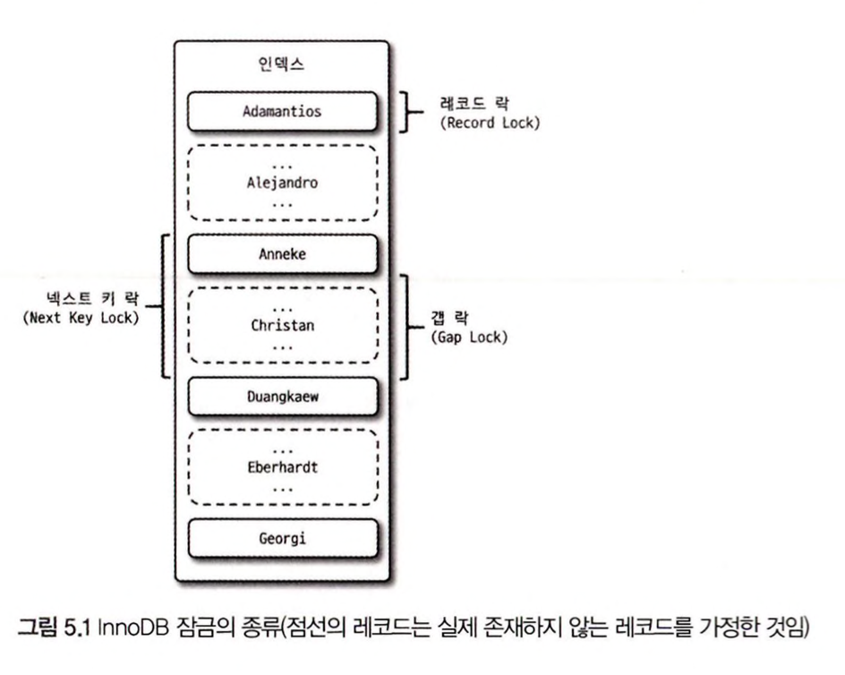

## [노션으로 보면 더욱 보기 편합니다!](https://near-sunscreen-c35.notion.site/5-1688c8e5d3e04931ac1265c93cd834a3)


# 5장 트랜잭션과 잠금

생성일: 익명
태그: 5장

---

이번 장은 잠금(Lock)과 트랜잭션, 트랜잭션의 격리 수준 (Isolation level)을 살펴본다

# 5.1 트랜잭션

## 5.1.1 Mysql에서의 트랜잭션

- 트랜잭션은 꼭 여러 개의 변경 작업을 수행하는 쿼리가 조합됐을 때만 의미있는게 아님
- 하나의 논리적인 작업 셋에 하나의 쿼리가 있든 두개든 관계없이 작업 셋이 100% 적용되거나 ROLLBACK 시켜야 함을 보장해주는 것

`간단한 예제 트랜잭션 관점에서 InnoDB, MyISAM 차이`

```sql
CREATE TABLE tab_myisam(
    fdpk INT NOT NULL ,
    PRIMARY KEY (fdpk)
) ENGINE = MyISAM;

CREATE TABLe tab_innodb(
    fdpk INT NOT NULL ,
    PRIMARY KEY (fdpk)
) ENGINE = INNODB;

INSERT INTO tab_myisam (fdpk) VALUES (3);
INSERT INTO tab_innodb (fdpk) VALUES (3);

INSERT INTO tab_myisam (fdpk) VALUES (1), (2), (3);
INSERT INTO tab_innodb (fdpk) VALUES (1), (2), (3);

-- 둘다 Duplicate netry '3' for key 'PRIMARY' 발생

select * from tab_myisam;
+------+
| fdpk |
+------+
|    1 |
|    2 |
|    3 |
+------+

select * from tab_innodb;
+------+
| fdpk |
+------+
|    3 |
+------+
```

`트랜잭션을 지원하지 않는 MyISAM과 InnoDB의 차이`

## 5.1.2 주의사항

- 꼭 필요한 상황에서 트랜잭션을 시작하자.
- 메일 전송이나 FTP 파일 전송 작업 또는 네트워크를 통하는 작업은 트랜잭션 내부에서 제거하가
- 저장 후 조회같은 작업은 트랜잭션으로 묶지 말자 ( 업무 요건에 따라 달라질 수 있음 )
    
    ex) 게시물 저장 후 조회 → 게시물 저장 ( 트랜잭션 커밋, 종료 ) 조회 ( 트랜잭션 연장 X)
    

---

# 5.2 MySQL 엔진의 잠금

`MYSQL 잠금`

- 스토리지 엔진 레벨, MySQL 레벨로 구분 가능
- MySQL 엔진은 스토리지 엔진을 제외한 나머지 부분이다.
- MySQL 엔진 레벨의 잠금은 스토리지에도 영향을 미치고, 스토리지 엔진레벨은 엔진간 상호 영향을 미치지 않음

### 5.2.1 글로벌 락 (GLOBAL LOCK)

- FLUSH TABLES WITH READ LOCK 명령으로 획득 가능
- MySQL 에서 제공하는 잠금 가운데 가방 범위가 크다.
- 한 세션에서 글로벌 락을 획득하면 다른 세션에서는 SELECT 를 제외한 대부분의 DDL, DML 문장을 실행할 경우 글로벌 락이 해제될 때까지 해당 문장은 대기로 남음
- 글로벌락은 DB 모든 곳에 영향을 미치며 작업 대상 테이블이나 데이터베이스가 다르더라도 동일하게 영향을 미침

**Mysql 8.0 부터 InnoDB 가 기본 스토리지 엔진이 되면서 가벼운 글로벌락이 생성됨 (백업 락 도입)**

```sql
mysql> LOCK INSTANCE FOR BACKUP;
-- BACK UP START
mysql> UNLOCK INSTANCE;
```

`특정 세션에서 백업락을 획득하면 모든 세션에서 다음과 같이 사용자 인증 관련 정보 변경 불가능`

- 데이터베이스 및 테이블 등 모든 객체 생성 및 변경, 삭제
- REPAIR TABLE과 OPTIMIZE TABLE 명령
- 사용자 관리 및 비밀번호 변경

## 5.2.2 테이블 락

- 테이블 락은 개별 테이블 단위로 설정되는 잠금이며, 명시적 묵시적으로 특정 테이블락 획득 가능
- 명시적 `LOCK TABLES table_name [ READ : WRITE ]` 명령으로 테이블락 획득 가능
- 명시적으로 획득한 잠금은 `UNLOCK TABLES` 명령으로 잠금 해제 가능

## 5.2.3 네임드 락

- `GET_LOCK()` 함수를 이용해 임의의 문자열에 대한 잠금 설정 가능

```sql
-- // mylock 라는 문자열에 대해 잠금 획득
-- 이미 잠금을 사용중이면 2초동안만 대기 ( 2초이후 자동 잠금 해제)
SELECT GET_LOCK9'mylock', 2)

-- "mylock" 문자가 잠금이 설정돼 있는지 확인
SELECT IS_FREE_LOCK('mylock');

-- "mylock" 이라는 문자열에 대해 획득했던 잠금을 반납 한다
SELECT RELEASE_LOCK('mylock');

-- 정상적으로 락을 획득하거나 해제한경우 1
-- 아니면 NULL OR 0
```

---

# 5.3 InnoDB 스토리지 엔진 자금

- InnoDB 스토리지 엔진은 MySQL 에서 제공하는 잠금과는 별개로 스토리지 엔진 내부에서 레코드 기반의 잠금 방식을 탑재
- 레코드 기반의 잠금 방식으로 MyISAM 보다 뛰어난 동시성 처리를 제공할 수 있음
- 최근 업데이트로 MySQL 서버의 information_schema 데이터 베이스에 존재하는
    
    `INNODB_TRX`, `INODB_LOCKS`, `INNODB_LOCKWAITS` 라는 테이블을 조인해서 어떤 트랜잭션이 잠금을 대기하고 해당잠금을 어떤 트랜잭션이 가지고 있는지 확인 가능
    

## 5.3.1 InnoDB 스토리지 엔진의 잠금

- 레코드 기반의 잠금 기능을 제공하며, 잠금 정보가 상당히 작은공관으로 관리
- 레코드 락이 페이지 락으로, 또는 테이블 락으로 레벨업 되는 경우는 없다.
- 다른 DBMS 와는 다르게 레코드 락뿐 아니라 레코드와 레코드 사이의 간격을 잠그는 갭(GAP) 락이라는것이 존재



### 5.3.1.1 레코드 락

- 레코드 자체만을 잠그는 것을 레코드 락 이라고 하며, 다른 DBMS와 같은 역할을 한다.
- 다른 DBMS 와 차이는 레코드 자체가아닌 인덱스의 레코드를 잠근다는 점
- 인덱스가 하나도 없는 테이블이더라도 내부적으로 자동 생성된 클러스터 인덱스를 이용하여 잠금 설정

### 5.3.1.2 갭 락

- 레코드와 바로 인접한 레코드 사이의 간격만을 잠그는 것을 의미
- 레코드와 레코드 사이의 간격에 새로운 레코드가 생성 되는 것을 제어하는 역할
- 넥스트 키 락의 일부로 주로 사용됨

### 5.3.1.3 넥스트 키 락

- 레코드 락과 갭 락을 합쳐 놓은 형태의 잠금을 넥스트 키 락 이라고 함
- Statement 포맷의 바이너리 로그를 사용하는  Mysql 서버에서는 Repeatable read 격리 수준을 사용해야함
- innodb_locks_unsafe_for_binlog 시스템 변수가 비활성화 되면 (0) 변경을 위해 검색하는 레코드에는 넥스트 키 락 방식의 잠금이 걸림
- InnoDB의 갭 락이나 넥스트 키 락은 바이너리 로구에 기록되는 쿼리가 레플리카 서버에서 실행될 때 소스 서버에서 만들어 낸 결과와 동일한 결과를 만들어 내도록 보장하는 것이 주목적

### 5.3.1.4 자동 증가 락

- MySQL 에서는 자동 증가하는 숫자 값을 추출 하기 위해 `AUTO_INCREMENT` 라는 칼럼 속성을 제공
- `AUTO_INCREMENT` 칼럼이 사용된 테이블에서는 저장되는 레코드가 중복되지않고 순서대로 증가하는 값을 가져야함, InnoDB 스토리지 엔진에서는 이를 내부적으로 `AUTO_INCREMENT ROCK` 라고 하는 테이블 수준의 잠금을 사용함

---

## 5.3.2 인덱스와 잠금

InnoDB의 잠금과 인덱스는 상당히 중요한 연관 관계가 있다

레코드 락을 소개하며 언급되었던 InnoDB는 레코드를 잠그는 것이 아닌 인덱스를 잠그는 방식이다

즉 변경해야 할 레코드를 찾기 위해 검색한 인덱스의 레코드를 모두 락을 걸어야 한다.

정확한 이해를 위해 다음 Update 문장을 보자

```sql
-- employees 테이블의 first_name 만 ix_firstname 이라는 인덱스가 존재

-- employees 테이블에서 first_name='Georgi' 사원은 전체 253명
-- first_name = 'Georgi' 이고 last_name = 'Klassen' 인 사원은 딱 1명
-- 아래 쿼리로 확인

mysql> select count(*) from employees WHERE first_name = 'Georgi';
+----------+
| count(*) |
+----------+
|      253 |
+----------+
1 row in set (0.01 sec)

mysql> select count(*) from employees WHERE first_name = 'Georgi' AND last_name = 'Klassen';
+----------+
| count(*) |
+----------+
|        1 |
+----------+
1 row in set (0.02 sec)

-- employees 테이블에서 first_name = 'Georgi' 이고 last_name = 'Klassen'
-- 위의 사원의 입사 일자를 오늘로 변경하는 쿼리를 실행

mysql> update employees set hire_date = NOW()
where first_name = 'Georgi' AND last_name = 'Klassen';
Query OK, 1 row affected, 1 warning (0.05 sec)
Rows matched: 1  Changed: 1  Warnings: 1
```

Update 문장이 실행되면 1건의 레코드가 업데이트 될 것이다.

하지만 이 1건의 업데이트를 위해 인덱스가 걸려있는 first_name 의 253건의 레코드가 모두 잠긴다.

이 예쩨에서는 몇건 안되는 레코드만 잠그지만 적절히 인덱스가 준비돼 있지 않다면

각 클라이언트 간의 동시성이 상당이 떨어져서 지연이 발생할 것이다.


이 테이블에 인덱스가 하나도 없다면 어떻게 될까? 이러한 경우에는 테이블을 풀 스캔하면서

Update 작업을 하는데 이 과정에서 테이블에 있는 30여만 건의 모든 레코드를 잠그게 된다.

`이것이 Mysql의 방식이며, Mysql 의 InnoDB에서 인덱스 설계가 중요한 이유다`

---

# 5.4 MySQL 의 격리 수준

트랜잭션 격리 수준 (isolation level) 이란 여러 트랜잭션이 동시에 처리될 때

특정 트랜잭션이 다른 트랜잭션에서 변경하거나 조회하는 데이터를 볼 수 없게 허용할지 말지를 결정하는 것이다.

`격리 수준`

- READ UNCOMMITTED
- READ COMMITTED
- REPEATABLE READ
- SERIALIZABLE

`DIRTY READ` 라고도 하는 READ UNCOMMITTED 는 일반적으로 거의 사용하지 않고

SERIALIZABLE 또한 동시성이 중요한 데이터베이스에서는 거의 사용되지 않는다.

4개의 격리 수준에서 뒤로 갈수록 각 트랜잭션 간의 데이터 격리 정도가 높아지며 

동시 처리 성능도 떨어지는 것이 일반적이라고 볼 수 있다.

데이터 격리 수준을 이야기하면 항상 언급되는 세가지 부정합의 문제


- 일반적인 서비스 용도의 데이터베이스에서는 주로 READ COMMITTED , REPEATABLE READ 중 사용
- 오라클은 READ COMMITTED 를 주로 사용하고 MySQL 은 REPEATABLE READ를 주로 사용함

`여기서 설명하는 SQL 예제는 모두 AUTO_COMMIT = OFF 상태 에서만 테스트 가능`

### 5.4.1 READ UNCOMMITTED

READ UNCOMMITTED 격리 수준에서는 각 트랜잭션에서의 변경 내용이

commit 나 rollback 여부에 상관없이 다른 트랜잭션에서 보인다.


`플랜`

1. 사용자 A는 emp_no가 500000 이고 first_name 이 Lara인 새로운 사원을 insert 
2. 사용자 B가 변경된 내용을 커밋하기도 전에 사용자 B는 emp_no=500000을 검색함 하지만 사용자 B는 사용자A 가 INSERT 한 사원의 정보를 커밋되지 않은 상태에서도 조회할 수 있다.
3. 여기서 문제는 A가 처리 도중 알 수 없는 문제가 발생해 INSERT 를 롤백한다 해도 여전히 사용자 B는 정상적인 사원이라고 생각하고 처리할 것이다.

이처럼 어떤 트랜잭션에서 처리한 작업이 완료되지 않았는데도 다른 트랜잭션에서 볼 수 있는 상황을

`더티 리드(Dirty read)` 라 하고, 더티리드가 혀용되는 격리 수준이 READ UNCOMMITTED 다

---

## 5.4.2 READ COMMITTED

READ COMMITTED 는 오라클 DBMS에서 기본으로 사용되는 격리 수준이며

온라인 서비스에서 가장 많이 선택되는 격리 수준이다. 

이 레벨에서는 더티 리드(Dirty read) 같은 현상은 발생하지 않는다.

어떤 트랜잭션에서 데이터를 변경했더라고 COMMIT이 완료된 데이터만 
다른 트랜잭션에서 조회가 가능하기 때문이다


`플랜`

1. A 는 emp_no=500000인 사원의 first_name 을 Lara 에서 Toto로 변경
2. 이때 Toto는 테이블에 즉시 기록되고 Lara 는 언두 로그 영역으로 백업
3. A가 커밋을 수행하기 전에 B가 조회할 경우 first_name 이 Toto 가 아닌 Lara로 조회됨

READ COMMITTED 격리 수준에서는 어떤 트랜잭션에서 변경한 내용이 

커밋되기 전까지 다른 트랜잭션에서는 그 내역을 조회할 수 없다.

READ COMMITTED 격리 수준에서도 `NON_REPEATABLE READ (REPETABLE READ 가 불가)` 라는 

부정합의 문제가 있다.


`플랜`

1. B가 트랜잭션 시작하고 first_name=Toto 검색 일치하는 결과가 없다.
2. A가 emp_no=500000 사원을 Toto로 변경하고 커밋
3. B가 조회 시 결과가 반환됨

이는 별다른 문제가 없어 보이지만 사실 사용자 B가 하나의 트랜잭션 내에서

똑같은 SELECT 쿼리를 실행 했을 때는 항상 같은 결과를 가져와야 한다는

`REPERTABLE READ` 정합성에 어긋나는 것

이러한 부정합은 일반적인 웹 프로그램에서는 크게 문제가 되지 않을 수 있지만

금전적인 처리와 연결되면 문제가 될 수 있다

예를 들어, 다른 트랜잭션에서 입금과 출금 처리가 계속 진행될 때 다른 트랜잭션에서 오늘 입금된 금액의

총합을 조회한다고 가정해보자 그런데 `REPERTABLE READ` 가 보장되지 ㅇ낳기 때문에

총합을 계산하는 SELECT 쿼리는 실행될 때마다 다른 결과를 가져올 것이다.

가끔 사용자 중에서 트랜잭션 내에서 실행되는 SELECT 문장과 

트랜잭션 없이 실행되는 문장의 차이를 혼동하는 경우가 있다.

`READ COMMITTED` 격리 수준에서는 차이가 크게 없다

하지만 `REPEATABLE READ` 격리 수준 에서는 기본적으로 SELECT 쿼리 문장도

트랜잭션 범위 내에서만 작동한다. 즉 트랜잭션 시작한 상태에서 온종일 동일한 쿼리만 반복해서

실행해 봐도 동일한 결과만 보게 된다 `아무리 다른 트랜잭션에서 그 데이터를 변경하고 COMMIT 하더라도`

---

## 5.4.3 REPEATABLE READ

`REPEATABLE READ` 는 MySQL 의 InnoDB 스토리지 엔진에서 기본으로 사용되는 결리 수준이다.

바이너리 로그를 가진 MySQL 서버에서는 최소 REPEATABLE READ 격리 수준 이상을 사용해야 한다.

이 격리 수준에서는 `READ COMMITTED` 에서 발생하는 `NON-REPEATABLE READ` 부정합이 발생하지 않는다.

InnoDB 스토리 엔진은 트랜잭션이 ROLLBACK 될 가능성에 대비해 변경되기전 레코드를

언두 공간에 백업해두고 실제 레코드 값을 변경한다.

`REPEATABLE READ` 와 `READ COMMITTED` 의 차이는 이 언두 영역에 백업된 레코드의 여러 버전 가운데

몇 번째 이전 버전까지 찾아 들어가냐의 차이


`플랜`

1. 이 시나리오가 실행되기 전에 employees 테이블은 번호가 6인 트랜잭션에 의해 INSERT 됐다고 가정
2. A의 트랜잭션 번호는 12 사용자 B의 트랜잭션 번호는 10
3. A가 사원의 이름을 Todo로 변경하고 커밋
4. 하지만 사용자 B가 emp_no=500000인 사원을 A 트랜잭션 변경 전 후 각각 한번씩 SELECT 했다면 결과는 항상 Lara라는 값을 가져온다

사용자 B가 트랜잭션을 시작하면서 10번이라는 번호를 부여받는데

그때부터 사용자 B의 10번 트랜잭션 안에서 실행되는 모든 SELECT 쿼리는 트랜잭션 번호가

`자신보다 작은 트랜잭션 번호에서 변경`한 것만 보인다

`REPEATABLE READ` 격리 수준에서도 다음과 같은 부정합이 발생할 수 있다.

`A가 employees 테이블에 INSERT 를 실행하는 도중 B가 SELECT FOR UPDATE 쿼리로 employees 조회`


`REPEATABLE READ 는 두번의 SELECT 를 해도 값이 같아야함`

B 트랜잭션 시작 후 SELECT .. FOR UPDATE 쿼리 결과는 서로 다르다

이렇게 다른 트랜잭션에서 수행한 변경 작업에 의해 레코드가 보였다 안 보였다 하는 현상을

`PHANTOM READ` 라고 한다.

SELECT .. FOR UPDATE 쿼리는 SELECT 하는 레코드에 쓰기 잠금을 걸어야하는데

언두 레코드에는 잠글을 걸 수 없다 그래서 현재 레코드의 값을 가져오는 것이다.

## 5.4.4 SERIALIZABLE

- 가장 단순한 격리 수준이면서 동시에 가장 엄격한 격리 수준
- 다른 트랜잭션 격리 수준보다 떨어짐
- 읽기 작업도 공유잠금(읽기 잠금)을 획득해야만 하며 동시에 다른 트랜잭션은 그러한 레코드를 변경하지 못하게 된다.
- 한 트랜잭션에서 읽고 쓰는 레코드를 다른 트랜잭션에서는 절대 접근할 수 없음
- `PHANTOM READ` 문제가 발생하지 않음
- 굳이 사용할 필요는 없다 금전적인게 아니면.